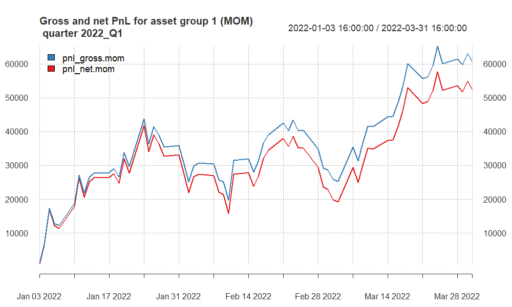
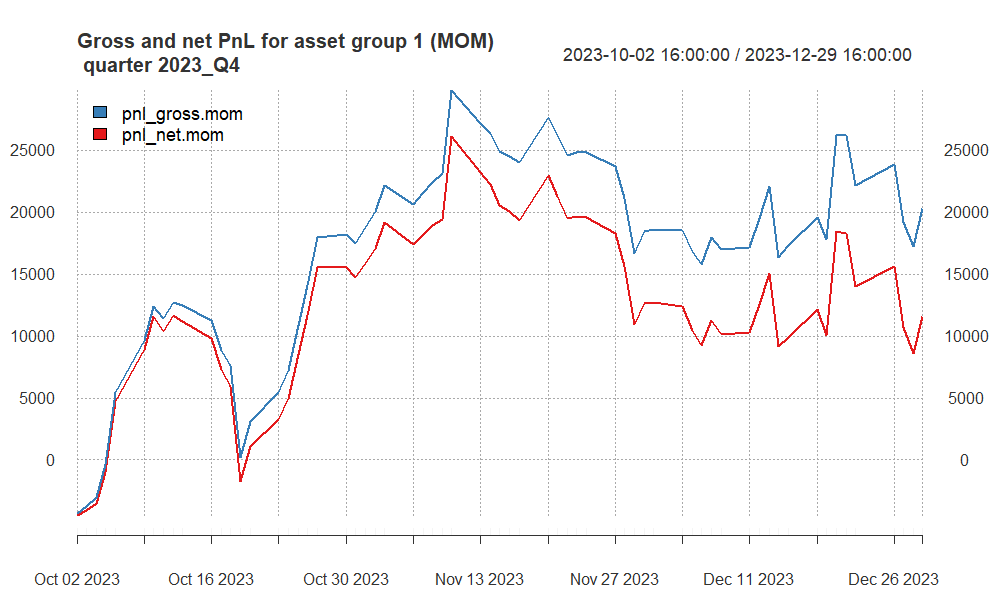
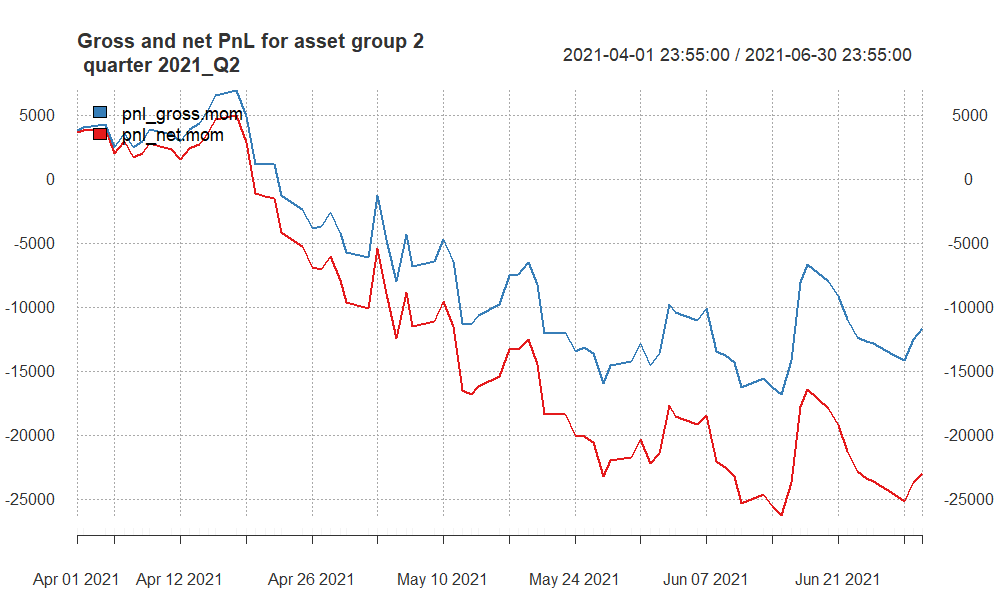
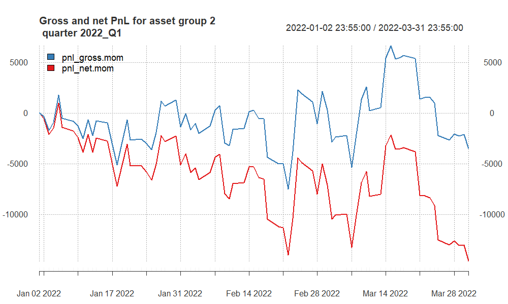
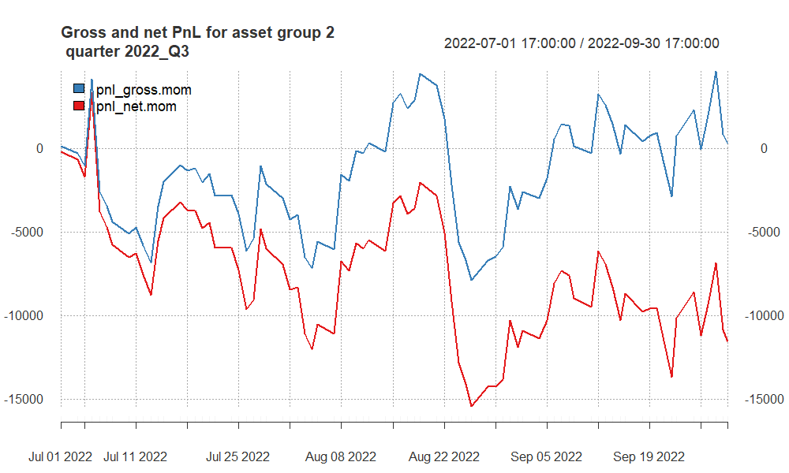
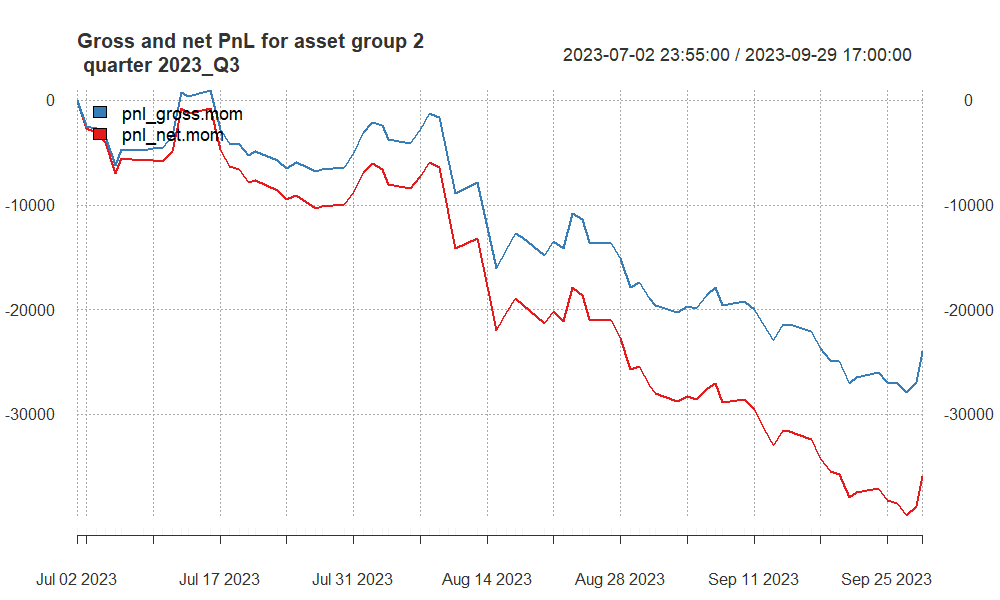
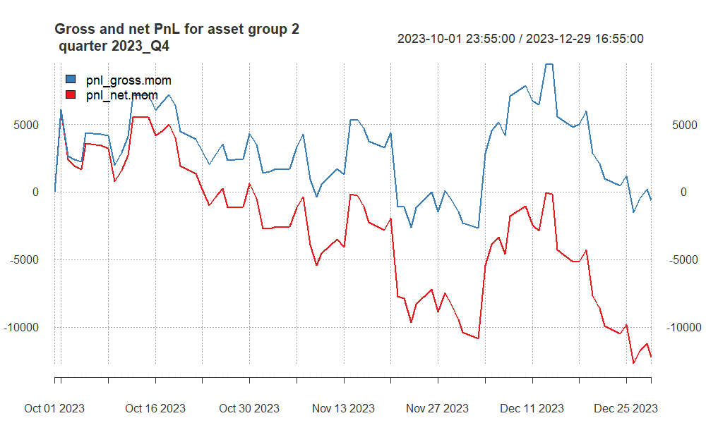

```{=html}
<!-- 
You can find more options here:
http://rmarkdown.rstudio.com/slidy_presentation_format.html
-->
```
## Approaches undertaken

**Group 1:**

The trading strategy for the S&P 500 (SP) and NASDAQ (NQ) indices employs a technical analysis approach utilizing Exponential Moving Averages (EMAs) to identify potential entry and exit points. This strategy specifically leverages the EMA55 and EMA80 as key indicators to capture medium to long-term trends and to smooth out market noise, allowing for a more reliable analysis of the market's direction.

**Group 2:**

The trading strategy for the Australian Dollar (AUD), Canadian Dollar (CAD), and Silver (XAG) futures markets incorporates a methodical approach using Exponential Moving Averages (EMAs) to discern and capitalize on market trends. Each asset within this strategy utilizes a tailored set of EMA periods to reflect its unique market behavior and liquidity characteristics, with the AUD employing EMA30 and EMA70, the CAD using EMA40 and EMA70, and the XAG leveraging EMA50 and EMA80.

-   The **AUD (EMA30 and EMA70)** and **CAD (EMA40 and EMA70)** strategies, with their lower period EMAs, may generate more trading signals and could potentially capture trends quicker.

    -   **AUD Strategy (EMA30 and EMA70)** - This strategy involves using a faster 30-period EMA and a slower 70-period EMA to generate trade signals for the Australian dollar futures. Each trade has a transaction cost of \$7, and the point value is \$100,000. For this strategy to break even on a round-trip trade, it needs to capture a movement of at least 0.00007 in the AUD futures price (since \$7 is the cost for a \$100,000 point value).
    -   **CAD Strategy (EMA40 and EMA70)** - The Canadian dollar futures trading uses a 40-period EMA and a 70-period EMA. Similar to the AUD, the transaction cost is \$7 per trade, and the point value is \$100,000. The break-even price movement for the CAD is the same as for the AUD, at 0.00007.

-   The **XAG (EMA50 and EMA80)** strategy, with its higher period EMAs, would be slower to react to price movements, potentially reducing the number of trades and false signals.

    -   The silver futures trading strategy uses a 50-period EMA and an 80-period EMA. The transaction cost is \$7, and the point value is \$5,000. To cover the cost of a round-trip trade, the XAG price must move at least 0.0014 points (\$7/\$5,000).

## Finally selected strategy for **group 1**

The use of EMA55 and EMA80 suggests that a trade is initiated when the shorter EMA (55) crosses the longer EMA (80). If EMA55 crosses above EMA80, it might signal a buy, and if it crosses below, it might signal a sell.

The choice of EMA55 and EMA80 is strategic. The 55-period EMA is often used by traders because it represents a quarterly market cycle (considering a 5-day trading week and 13 weeks in a quarter). It serves as a barometer for intermediate trend direction. The 80-period EMA is chosen to provide an even longer-term perspective, aligning closely with market dynamics that span across multiple quarters, offering a balance between sensitivity and reliability.

**WHY EMA55 and EMA80?**

1.  **Risk Management**: By utilizing two EMAs with these specific periods, the strategy aims to minimize false signals that are often present in more reactive, short-term moving averages. This can help in avoiding the whipsaw effect in highly volatile markets like SP and NQ, where short-term movements can be erratic.

2.  **Trend Confirmation**: The EMA55 acts as a trend filter, helping to confirm the market's direction before positions are taken. When the market price is above the EMA55, it indicates a potential bullish trend, and conversely, when it is below, it may signal a bearish trend.

3.  **Signal Reinforcement**: The EMA80 reinforces signals given by the EMA55. A crossover of the EMA55 above the EMA80 may suggest a strong buy signal, whereas a crossover below may indicate a strong sell signal. This longer period EMA serves as a support or resistance level, providing a more substantial backdrop for decision-making.

4.  **Market Sentiment**: Both EMAs are significant not just for individual decision-making, but they are also watched by numerous market participants. Their common use across traders and institutions can create self-fulfilling prophecies, reinforcing the strength of the signals they provide.

5.  **Adaptability**: The EMA55 and EMA80 are responsive enough to adapt to market changes over a few weeks, which is crucial for capturing gains in the indices' futures market, while still being distant enough to filter out insignificant price movements.

In conclusion, the strategic application of EMA55 and EMA80 in trading the SP and NQ futures is designed to capitalize on sustained trends, reduce the impact of market volatility, and enhance the robustness of trade signals for improved decision-making in both bullish and bearish scenarios.

```{=html}
<!-- here you can include code chunk that applies the strategy for group 1 and calculates all the summary statistics
-->
```
```{r, echo = F, warning = F, message = F}
# here you can refer to the R codes that apply the strategy
# for asset group 1 to all quarters (in a loop)

source("apply_my_strategy_group1 - oos.R")
```

## Summary of results for **group 1**

```{r, echo = F}
names(quarter_stats_oos1.all.group1)[5] <- "av.ntrades"
column_spec(
kable_styling(kable(quarter_stats_oos1.all.group1[, -2], 
                    "html", 
                    digits = 2,
                    align = "r"),
             font_size = 20),
1:7, width = "30em")

# more options here:
# https://haozhu233.github.io/kableExtra/awesome_table_in_html.html
```


## PnL of results for **group 1** -- quarter 2021Q2

```{r, echo = F, out.width ='90%'}
knitr::include_graphics("pnl_group1_2021_Q2.png")

```

## PnL of results for **group 1** -- quarter 2022Q1

```{r, echo = F, out.width ='80%'}


```

## PnL of results for **group 1** -- quarter 2022Q3

```{r, echo = F, out.width ='80%'}
knitr::include_graphics("pnl_group1_2022_Q3.png")

```

## PnL of results for **group 1** -- quarter 2023Q3

```{r, echo = F, out.width ='80%'}
knitr::include_graphics("pnl_group1_2023_Q3.png")

```

## PnL of results for **group 1** -- quarter 2023Q4

```{r, echo = F, out.width ='80%'}


```


## Finally selected strategy for **group 2**

**WHY Specific EMA Settings for Each Asset:**

1. **AUD Strategy (EMA30 and EMA70)**: The AUD market is known for its correlation with commodity price movements and can exhibit trend shifts relatively quickly. The EMA30 provides a responsive indicator to pick up on these changes, while the EMA70 offers a longer-term trend perspective, enhancing the robustness of the signal by filtering out short-term fluctuations.

2. **CAD Strategy (EMA40 and EMA70)**: The CAD, often influenced by oil prices and North American economic indicators, requires a balance between responsiveness and long-term trend analysis. The EMA40 is chosen to react to market changes that are significant enough to consider, while still allowing the EMA70 to confirm the longer-term trend direction.

3. **XAG Strategy (EMA50 and EMA80)**: Silver markets is volatile with extended trends due to industrial demand and investment flows. The EMA50 offers a medium-term view that is less susceptible to rapid market changes, while the EMA80 provides a solid baseline for the market's overall direction, making it suitable for capturing longer and sustained trends in the XAG market.

**Elimination of Gold (XAU) Futures:** 
***(WHY?)***

1. **Higher Transaction Costs**: With a transaction cost of $12, trading gold futures is more expensive compared to other assets. This higher cost can significantly eat into the profits, especially in a strategy that relies on EMA crossovers, which may generate a higher number of trades.

2. **Point Value Sensitivity**: The point value of \$100 for gold futures signifies that each point movement represents a \$100 change in value. This can lead to high volatility in PnL, which, when coupled with high transaction costs, not align with the risk management parameters of the strategy.

3. **Strategy Performance**: Historical performance data for the gold futures within the context of this strategy indicated underperformance compared to AUD, CAD, and XAG. This could be due to the less effective application of the selected EMA periods or the asset's characteristics not fitting well with the strategy's design.

The tailored EMA settings for AUD, CAD, and XAG are designed to align with each market's specific characteristics and volatility profiles, aiming to optimize the strategy's effectiveness. The exclusion of XAU futures is a strategic choice to enhance overall performance, manage costs, and maintain the strategy's risk profile within acceptable parameters.

```{=html}
<!-- here you can include code chunk that applies the strategy for group 1 and calculates all the summary statistics
-->
```
```{r, echo = F, warning = F, message = F}
# here you can refer to the R codes that apply the strategy
# for asset group 2 to all quarters (in a loop)

source("apply_my_strategy_group2 - oos.R")
```

## Summary of results for **group 2**

```{r, echo = F}
names(quarter_stats_oos1.all.group2)[5] <- "av.ntrades"
column_spec(
kable_styling(kable(quarter_stats_oos1.all.group2[, -2], 
                    "html", 
                    digits = 2,
                    align = "r"),
             font_size = 20),
1:7, width = "30em")

# more options here:
# https://haozhu233.github.io/kableExtra/awesome_table_in_html.html
```

## PnL of results for **group 2** -- quarter 2021Q2

```{r, echo = F, out.width ='80%'}


```


## PnL of results for **group 2** -- quarter 2022Q1

```{r, echo = F, out.width ='80%'}


```


## PnL of results for **group 2** -- quarter 2022Q3

```{r, echo = F, out.width ='80%'}


```


## PnL of results for **group 2** -- quarter 2023Q3

```{r, echo = F, out.width ='80%'}


```


## PnL of results for **group 2** -- quarter 2023Q4

```{r, echo = F, out.width ='80%'}


```

# Summary and conclusions

**Group 1:**

**Group 2:**

