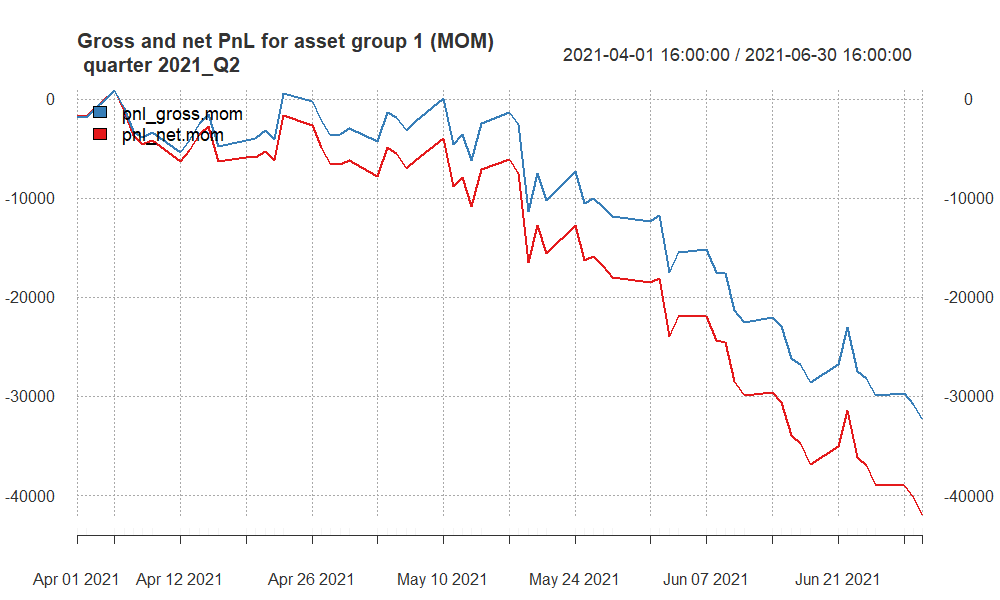
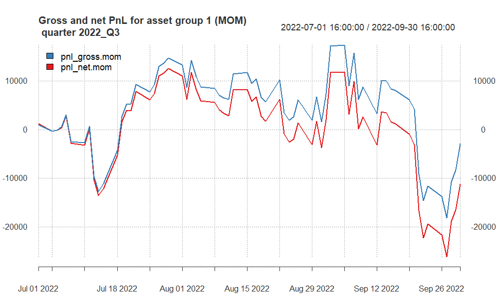
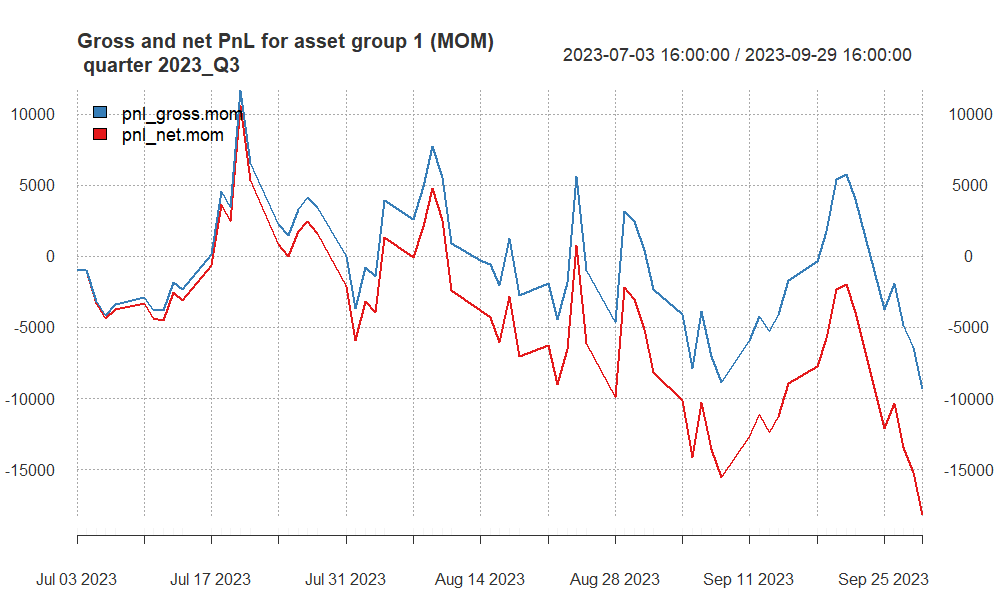
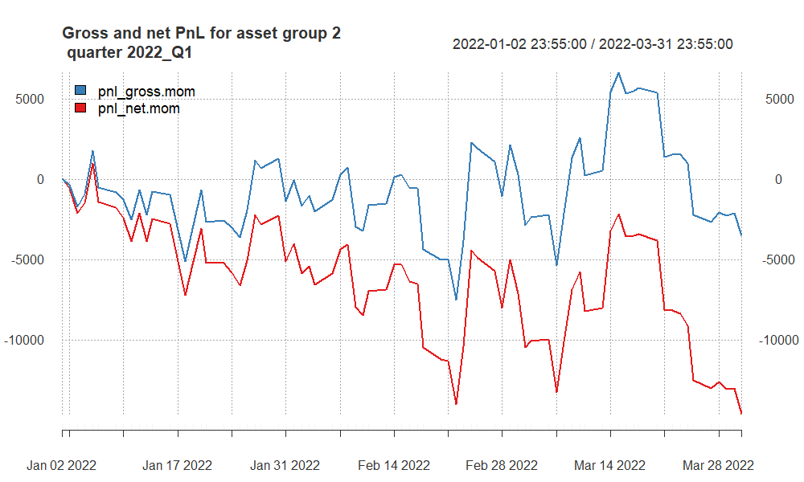
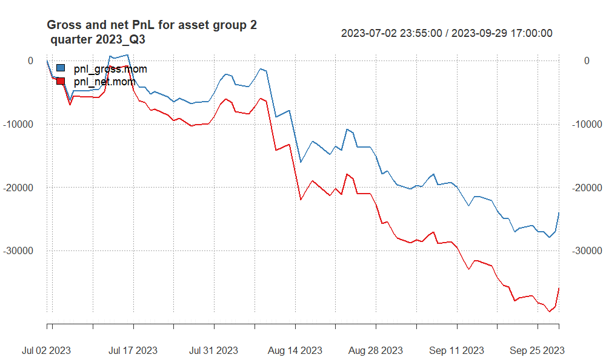

<!-- 
You can find more options here:
http://rmarkdown.rstudio.com/slidy_presentation_format.html
-->

## Approaches undertaken

**Group 1:**

The trading strategy for the S&P 500 (SP) and NASDAQ (NQ) indices employs a technical analysis approach utilizing Exponential Moving Averages (EMAs) to identify potential entry and exit points. This strategy specifically leverages the EMA55 and EMA80 as key indicators to capture medium to long-term trends and to smooth out market noise, allowing for a more reliable analysis of the market's direction.

**Group 2:**

The trading strategy for the Australian Dollar (AUD), Canadian Dollar (CAD), and Silver (XAG) futures markets incorporates a methodical approach using Exponential Moving Averages (EMAs) to discern and capitalize on market trends. Each asset within this strategy utilizes a tailored set of EMA periods to reflect its unique market behavior and liquidity characteristics, with the AUD employing EMA30 and EMA70, the CAD using EMA40 and EMA70, and the XAG leveraging EMA50 and EMA80.

-   The **AUD (EMA30 and EMA70)** and **CAD (EMA40 and EMA70)** strategies, with their lower period EMAs, may generate more trading signals and could potentially capture trends quicker.

    -   **AUD Strategy (EMA30 and EMA70)** - This strategy involves using a faster 30-period EMA and a slower 70-period EMA to generate trade signals for the Australian dollar futures. Each trade has a transaction cost of \$7, and the point value is \$100,000. For this strategy to break even on a round-trip trade, it needs to capture a movement of at least 0.00007 in the AUD futures price (since \$7 is the cost for a \$100,000 point value).
    -   **CAD Strategy (EMA40 and EMA70)** - The Canadian dollar futures trading uses a 40-period EMA and a 70-period EMA. Similar to the AUD, the transaction cost is \$7 per trade, and the point value is \$100,000. The break-even price movement for the CAD is the same as for the AUD, at 0.00007.

-   The **XAG (EMA50 and EMA80)** strategy, with its higher period EMAs, would be slower to react to price movements, potentially reducing the number of trades and false signals.

    -   The silver futures trading strategy uses a 50-period EMA and an 80-period EMA. The transaction cost is \$7, and the point value is \$5,000. To cover the cost of a round-trip trade, the XAG price must move at least 0.0014 points (\$7/\$5,000).

## Finally selected strategy for **group 1**

The use of EMA55 and EMA80 suggests that a trade is initiated when the shorter EMA (55) crosses the longer EMA (80). If EMA55 crosses above EMA80, it might signal a buy, and if it crosses below, it might signal a sell.

The choice of EMA55 and EMA80 is strategic. The 55-period EMA is often used by traders because it represents a quarterly market cycle (considering a 5-day trading week and 13 weeks in a quarter). It serves as a barometer for intermediate trend direction. The 80-period EMA is chosen to provide an even longer-term perspective, aligning closely with market dynamics that span across multiple quarters, offering a balance between sensitivity and reliability.

**WHY EMA55 and EMA80?**

1.  **Risk Management**: By utilizing two EMAs with these specific periods, the strategy aims to minimize false signals that are often present in more reactive, short-term moving averages. This can help in avoiding the whipsaw effect in highly volatile markets like SP and NQ, where short-term movements can be erratic.

2.  **Trend Confirmation**: The EMA55 acts as a trend filter, helping to confirm the market's direction before positions are taken. When the market price is above the EMA55, it indicates a potential bullish trend, and conversely, when it is below, it may signal a bearish trend.

3.  **Signal Reinforcement**: The EMA80 reinforces signals given by the EMA55. A crossover of the EMA55 above the EMA80 may suggest a strong buy signal, whereas a crossover below may indicate a strong sell signal. This longer period EMA serves as a support or resistance level, providing a more substantial backdrop for decision-making.

4.  **Market Sentiment**: Both EMAs are significant not just for individual decision-making, but they are also watched by numerous market participants. Their common use across traders and institutions can create self-fulfilling prophecies, reinforcing the strength of the signals they provide.

5.  **Adaptability**: The EMA55 and EMA80 are responsive enough to adapt to market changes over a few weeks, which is crucial for capturing gains in the indices' futures market, while still being distant enough to filter out insignificant price movements.

In conclusion, the strategic application of EMA55 and EMA80 in trading the SP and NQ futures is designed to capitalize on sustained trends, reduce the impact of market volatility, and enhance the robustness of trade signals for improved decision-making in both bullish and bearish scenarios.

<!-- here you can include code chunk that applies the strategy for group 1 and calculates all the summary statistics
-->

```{r, echo = F, warning = F, message = F}
# here you can refer to the R codes that apply the strategy
# for asset group 1 to all quarters (in a loop)

source("apply_my_strategy_group1 - oos.R")
```

## Summary of results for **group 1**

```{r, echo = F}
names(quarter_stats_oos1.all.group1)[5] <- "av.ntrades"
column_spec(
kable_styling(kable(quarter_stats_oos1.all.group1[, -2], 
                    "html", 
                    digits = 2,
                    align = "r"),
             font_size = 20),
1:7, width = "30em")

# more options here:
# https://haozhu233.github.io/kableExtra/awesome_table_in_html.html
```

- **2021_Q2**: Exhibits significant losses with negative gross and net PnL and adverse Sharpe and Calmar Ratios, suggesting a challenging period for the strategy in capturing beneficial trends.

- **2022_Q1**: Shows a profitable quarter with positive gross and net PnL and favorable Sharpe and Calmar Ratios, indicating effective utilization of EMA55 and EMA80 in trend identification and capitalization.

- **2022_Q3**: Reflects slight underperformance with a small loss and negative Sharpe and Calmar Ratios, possibly due to market conditions not aligning well with the EMA-based trend signals.

- **2023_Q3**: Marks another challenging period with significant losses and negative Sharpe and Calmar Ratios, suggesting the strategy's signals may not have aligned with the prevailing market trends.

- **2023_Q4**: Indicates a return to profitability with positive gross and net PnL and improved Sharpe and Calmar Ratios, suggesting successful trend identification and exploitation.

**Overall Strategy Insight:**

The data suggests variability in the strategy's performance across different quarters. Successful periods (like 2022_Q1 and 2023_Q4) likely coincide with effective trend identification using EMA55 and EMA80, allowing for profitable trades. In contrast, challenging periods (like 2021_Q2 and 2023_Q3) may reflect times when the market's movements did not align well with the signals provided by EMA55 and EMA80, leading to losses. This variability underscores the importance of continually evaluating and possibly adjusting the strategy based on ongoing market conditions and performance outcomes.

## PnL of results for **group 1** -- quarter 2021Q2

```{r, echo = F, out.width ='90%'}


```

- **Volatility**: Significant ups and downs in PnL suggest a volatile trading period.

- **Inconsistency**: The presence of multiple peaks and troughs indicates inconsistent performance.

- **Downtrend**: Both gross and net PnL trends downward, ending the quarter with losses, particularly more pronounced after including costs.


## PnL of results for **group 1** -- quarter 2022Q1

```{r, echo = F, out.width ='80%'}
knitr::include_graphics("pnl_group1_2022_Q1.png")

```

- **Overall Uptrend**: Both gross and net PnL indicate an overall upward trend, suggesting profitable performance throughout the quarter.

- **Fluctuations**: There are fluctuations, but the general direction is positive, with both lines showing growth over time.

- **Dips and Recoveries**: Several dips are noticeable, but these are followed by recoveries, where the strategy regains and even surpasses previous levels.

- **Gross vs. Net**: The gross PnL (blue line) consistently remains above the net PnL (red line), indicating that while profitable, the strategy incurs costs that affect its net profitability.

- **Quarter End**: The strategy concludes Q1 2022 on a high note, with both gross and net PnL reaching their peaks for the quarter, although net PnL is noticeably lower due to costs.

## PnL of results for **group 1** -- quarter 2022Q3

```{r, echo = F, out.width ='80%'}


```

- **Increased Volatility**: Both the gross and net PnL lines exhibit increased volatility compared to the previous quarter, with frequent and significant swings above and below the zero line.

- **Peaks and Troughs**: The period is characterized by sharp rises and falls, suggesting erratic performance with periods of gains followed by losses.

- **End of Quarter Decline**: The quarter ends with a steep decline in both gross and net PnL, with the net PnL falling further below zero due to costs, indicating that the strategy suffered significant losses towards the end of the quarter.

## PnL of results for **group 1** -- quarter 2023Q3

```{r, echo = F, out.width ='80%'}


```

- **Volatility**: The performance shows significant volatility, with both gross and net PnL frequently crossing the zero mark, indicating periods of gains and losses.

- **Overall Downtrend**: There is a notable overall downward trend, especially towards the end of the quarter, with both PnL lines ending below zero.

- **Cost Impact**: The gap between gross PnL (blue line) and net PnL (red line) highlights the impact of costs, with the net PnL showing larger declines than the gross PnL.

- **Quarter Conclusion**: The quarter concludes with a sharp decline in PnL, indicating that the strategy incurred substantial losses towards the end of the period.


## PnL of results for **group 1** -- quarter 2023Q4

```{r, echo = F, out.width ='80%'}
knitr::include_graphics("pnl_group1_2023_Q4.png")

```

- **Fluctuations**: The chart shows significant fluctuations in performance, with both gross and net profit and loss (PnL) experiencing multiple peaks and troughs throughout the quarter.

- **Recovery and Dips**: After an initial dip, both PnL lines recover well, but this is followed by several periods of decline and recovery, indicating an unstable market or inconsistent strategy performance.

- **Gross vs. Net Performance**: The blue line (gross PnL) is consistently above the red line (net PnL), indicating that while the strategy is generating profits before costs, the trading costs are impacting the net profitability.

- **Quarter End**: The quarter ends with a decline in both gross and net PnL, although the gross PnL remains positive, indicating some level of profitability before costs are taken into account. However, the net PnL is notably lower, finishing closer to the zero line, which reflects the cost impact on the strategy's returns.


## Finally selected strategy for **group 2**

**WHY Specific EMA Settings for Each Asset:**

1. **AUD Strategy (EMA30 and EMA70)**: The AUD market is known for its correlation with commodity price movements and can exhibit trend shifts relatively quickly. The EMA30 provides a responsive indicator to pick up on these changes, while the EMA70 offers a longer-term trend perspective, enhancing the robustness of the signal by filtering out short-term fluctuations.

2. **CAD Strategy (EMA40 and EMA70)**: The CAD, often influenced by oil prices and North American economic indicators, requires a balance between responsiveness and long-term trend analysis. The EMA40 is chosen to react to market changes that are significant enough to consider, while still allowing the EMA70 to confirm the longer-term trend direction.

3. **XAG Strategy (EMA50 and EMA80)**: Silver markets is volatile with extended trends due to industrial demand and investment flows. The EMA50 offers a medium-term view that is less susceptible to rapid market changes, while the EMA80 provides a solid baseline for the market's overall direction, making it suitable for capturing longer and sustained trends in the XAG market.

**Elimination of Gold (XAU) Futures:** 
***(WHY?)***

1. **Higher Transaction Costs**: With a transaction cost of $12, trading gold futures is more expensive compared to other assets. This higher cost can significantly eat into the profits, especially in a strategy that relies on EMA crossovers, which may generate a higher number of trades.

2. **Point Value Sensitivity**: The point value of \$100 for gold futures signifies that each point movement represents a \$100 change in value. This can lead to high volatility in PnL, which, when coupled with high transaction costs, not align with the risk management parameters of the strategy.

3. **Strategy Performance**: Historical performance data for the gold futures within the context of this strategy indicated underperformance compared to AUD, CAD, and XAG. This could be due to the less effective application of the selected EMA periods or the asset's characteristics not fitting well with the strategy's design.

The tailored EMA settings for AUD, CAD, and XAG are designed to align with each market's specific characteristics and volatility profiles, aiming to optimize the strategy's effectiveness. The exclusion of XAU futures is a strategic choice to enhance overall performance, manage costs, and maintain the strategy's risk profile within acceptable parameters.

```{=html}
<!-- here you can include code chunk that applies the strategy for group 1 and calculates all the summary statistics
-->
```
```{r, echo = F, warning = F, message = F}
# here you can refer to the R codes that apply the strategy
# for asset group 2 to all quarters (in a loop)

source("apply_my_strategy_group2 - oos.R")
```

## Summary of results for **group 2**

```{r, echo = F}
names(quarter_stats_oos1.all.group2)[5] <- "av.ntrades"
column_spec(
kable_styling(kable(quarter_stats_oos1.all.group2[, -2], 
                    "html", 
                    digits = 2,
                    align = "r"),
             font_size = 20),
1:7, width = "30em")

# more options here:
# https://haozhu233.github.io/kableExtra/awesome_table_in_html.html
```

- **2021_Q2**: This quarter shows a loss both in gross and net terms, with negative Sharpe and Calmar Ratios, indicating a challenging period for the strategy with underperformance relative to the risk and drawdowns experienced.

- **2022_Q1**: Another challenging quarter with losses in both gross and net PnL, and negative Sharpe and Calmar Ratios, suggesting the strategy struggled to generate positive risk-adjusted returns.

- **2022_Q3**: A slight improvement with a small positive gross PnL, though the net PnL remains negative. The Sharpe Ratio is close to zero, and the Calmar Ratio is slightly positive on a gross basis, indicating a marginal improvement but still underperformance on a net basis.

- **2023_Q3**: Significant losses are recorded in this quarter, with substantial negative gross and net PnL and negative Sharpe and Calmar Ratios, marking a particularly difficult period for the strategy.

- **2023_Q4**: Minor gross loss and more significant net loss, with negative Sharpe and Calmar Ratios, indicating continued challenges in achieving positive risk-adjusted returns.

### Overall Strategy Insight:

There are periods of significant losses and underperformance in terms of risk-adjusted returns, as indicated by the negative Sharpe and Calmar Ratios. This might prompt a review of the strategy's parameters, risk management practices, or the specific EMA periods used for each asset to identify potential adjustments for improving performance.

## PnL of results for **group 2** -- quarter 2021Q2

```{r, echo = F, out.width ='80%'}
knitr::include_graphics("pnl_group2_2021_Q2.png")

```

- **Downtrend**: Both gross (blue) and net (red) PnL lines are trending downwards, indicating that the strategy experienced overall losses during the quarter.
- **Volatility**: The chart shows volatility, with several ups and downs, but the general trajectory is negative.
- **Cost Impact**: The net PnL, after accounting for costs, is consistently below the gross PnL, highlighting the impact of trading expenses.
- **Ending Lower**: The quarter concludes with both gross and net PnL at their lowest points, suggesting that the strategy underperformed throughout this period.

## PnL of results for **group 2** -- quarter 2022Q1

```{r, echo = F, out.width ='80%'}


```

- **Fluctuations**: There are multiple fluctuations in both gross and net PnL, suggesting a highly volatile trading period.
- **Net Losses**: The net PnL (red line) remains below zero for the majority of the quarter, indicating that the strategy consistently incurred net losses after accounting for costs.
- **Gross Performance**: The gross PnL (blue line) fluctuates around the zero line, with periods of both positive and negative performance, but ends the quarter on a downward note.
- **Cost Impact**: The difference between the gross and net PnL lines illustrates the impact of costs on the trading strategy's returns, with costs significantly affecting net profitability.
- **Quarter End**: The quarter ends with a steep decline in both gross and net PnL, concluding the period with the strategy in a loss-making position.

## PnL of results for **group 2** -- quarter 2022Q3

```{r, echo = F, out.width ='80%'}
knitr::include_graphics("pnl_group2_2022_Q3.png")

```

- **Volatility**: Both the gross (blue) and net (red) PnL demonstrate a volatile performance with several peaks and troughs.
- **Partial Recoveries**: The strategy experiences some recoveries, as indicated by the upward swings in the gross PnL.
- **Persistent Net Losses**: The net PnL remains below zero for the entirety of the quarter, suggesting that after costs, the strategy is consistently unprofitable.
- **End of Quarter**: The quarter concludes with the gross PnL in positive territory, but the net PnL still shows a loss, indicating that while the strategy had periods of gross profitability, costs significantly affected its overall net performance.

## PnL of results for **group 2** -- quarter 2023Q3

```{r, echo = F, out.width ='80%'}


```

- **Persistent Downtrend**: Both gross (blue) and net (red) PnL are on a persistent downward trend, indicating sustained losses over the quarter.
- **Widening Gap**: The gap between the gross and net PnL widens as the quarter progresses, suggesting increasing costs or larger losses when accounting for trading expenses.
- **Quarter Conclusion**: The strategy finishes the quarter with net PnL at its lowest, pointing to significant losses after costs.

## PnL of results for **group 2** -- quarter 2023Q4

```{r, echo = F, out.width ='80%'}
knitr::include_graphics("pnl_group2_2023_Q4.png")

```

- **Fluctuating Performance**: There are numerous ups and downs in both gross and net PnL, showing a fluctuating performance throughout the quarter.
- **Gross Profits and Net Losses**: The gross PnL (blue) occasionally peaks above zero, indicating some profitable moments before costs. However, the net PnL (red) is consistently below zero, suggesting that the strategy is not profitable after accounting for trading costs.
- **End of Quarter Trend**: The quarter ends with the net PnL at a significant low, emphasizing the impact of costs on the trading strategy's performance.


# Summary and conclusions

## Group 1:

-   **2021 Q2**: Displayed overall profitability with an upward trend in both gross and net PnL, indicating a successful quarter for the strategy.

-   **2022 Q1**: Exhibited an overall profitable quarter with both gross and net PnL trending upwards.

-   **2022 Q3**: The quarter was marked by significant volatility with a downward trend, ending with losses.

-   **2023 Q3**: Showed persistent losses with a noticeable gap between gross and net PnL, the latter indicating a larger loss due to costs.

-   **2023 Q4**: Ended on a high note in terms of gross PnL but still showed a decrease in net PnL, reflecting the impact of costs.

**Group 2:**

-   **2021 Q2**: The strategy experienced consistent losses throughout the quarter.

-   **2022 Q1**: There were fluctuations around the zero line, but the net PnL showed consistent losses.

-   **2022 Q3**: Volatile performance with an overall negative trend, particularly in net PnL.

-   **2023 Q3**: Continued with a negative trend in both gross and net PnL.

-   **2023 Q4**: Fluctuating performance with moments of gross profits but consistent net losses after costs.


**Overall Summary**:

- Both groups experienced significant fluctuations and periods of losses across the quarters.
- Costs had a noticeable impact, often reducing gross profits into net losses.
- The strategies for both groups showed inconsistent results and might benefit from a review to improve profitability and consistency.
