```{=html}
<!-- 
You can find more options here:
http://rmarkdown.rstudio.com/slidy_presentation_format.html
-->
```
## Approaches undertaken

**Group 1:**

The trading strategy for the S&P 500 (SP) and NASDAQ (NQ) indices employs a technical analysis approach utilizing Exponential Moving Averages (EMAs) to identify potential entry and exit points. This strategy specifically leverages the EMA55 and EMA80 as key indicators to capture medium to long-term trends and to smooth out market noise, allowing for a more reliable analysis of the market's direction.

**Group 2:**

The trading strategy for the Australian Dollar (AUD), Canadian Dollar (CAD), and Silver (XAG) futures markets incorporates a methodical approach using Exponential Moving Averages (EMAs) to discern and capitalize on market trends. Each asset within this strategy utilizes a tailored set of EMA periods to reflect its unique market behavior and liquidity characteristics, with the AUD employing EMA30 and EMA70, the CAD using EMA40 and EMA70, and the XAG leveraging EMA50 and EMA80.

-   The **AUD (EMA30 and EMA70)** and **CAD (EMA40 and EMA70)** strategies, with their lower period EMAs, may generate more trading signals and could potentially capture trends quicker.

    -   **AUD Strategy (EMA30 and EMA70)** - This strategy involves using a faster 30-period EMA and a slower 70-period EMA to generate trade signals for the Australian dollar futures. Each trade has a transaction cost of \$7, and the point value is \$100,000. For this strategy to break even on a round-trip trade, it needs to capture a movement of at least 0.00007 in the AUD futures price (since \$7 is the cost for a \$100,000 point value).
    -   **CAD Strategy (EMA40 and EMA70)** - The Canadian dollar futures trading uses a 40-period EMA and a 70-period EMA. Similar to the AUD, the transaction cost is \$7 per trade, and the point value is \$100,000. The break-even price movement for the CAD is the same as for the AUD, at 0.00007.

-   The **XAG (EMA50 and EMA80)** strategy, with its higher period EMAs, would be slower to react to price movements, potentially reducing the number of trades and false signals.

    -   The silver futures trading strategy uses a 50-period EMA and an 80-period EMA. The transaction cost is \$7, and the point value is \$5,000. To cover the cost of a round-trip trade, the XAG price must move at least 0.0014 points (\$7/\$5,000).

## Finally selected strategy for **group 1**

The use of EMA55 and EMA80 suggests that a trade is initiated when the shorter EMA (55) crosses the longer EMA (80). If EMA55 crosses above EMA80, it might signal a buy, and if it crosses below, it might signal a sell.

The choice of EMA55 and EMA80 is strategic. The 55-period EMA is often used by traders because it represents a quarterly market cycle (considering a 5-day trading week and 13 weeks in a quarter). It serves as a barometer for intermediate trend direction. The 80-period EMA is chosen to provide an even longer-term perspective, aligning closely with market dynamics that span across multiple quarters, offering a balance between sensitivity and reliability.

**WHY EMA55 and EMA80?**

1.  **Risk Management**: By utilizing two EMAs with these specific periods, the strategy aims to minimize false signals that are often present in more reactive, short-term moving averages. This can help in avoiding the whipsaw effect in highly volatile markets like SP and NQ, where short-term movements can be erratic.

2.  **Trend Confirmation**: The EMA55 acts as a trend filter, helping to confirm the market's direction before positions are taken. When the market price is above the EMA55, it indicates a potential bullish trend, and conversely, when it is below, it may signal a bearish trend.

3.  **Signal Reinforcement**: The EMA80 reinforces signals given by the EMA55. A crossover of the EMA55 above the EMA80 may suggest a strong buy signal, whereas a crossover below may indicate a strong sell signal. This longer period EMA serves as a support or resistance level, providing a more substantial backdrop for decision-making.

4.  **Market Sentiment**: Both EMAs are significant not just for individual decision-making, but they are also watched by numerous market participants. Their common use across traders and institutions can create self-fulfilling prophecies, reinforcing the strength of the signals they provide.

5.  **Adaptability**: The EMA55 and EMA80 are responsive enough to adapt to market changes over a few weeks, which is crucial for capturing gains in the indices' futures market, while still being distant enough to filter out insignificant price movements.

In conclusion, the strategic application of EMA55 and EMA80 in trading the SP and NQ futures is designed to capitalize on sustained trends, reduce the impact of market volatility, and enhance the robustness of trade signals for improved decision-making in both bullish and bearish scenarios.

```{=html}
<!-- here you can include code chunk that applies the strategy for group 1 and calculates all the summary statistics
-->
```
```{r, echo = F, warning = F, message = F}
# here you can refer to the R codes that apply the strategy
# for asset group 1 to all quarters (in a loop)

source("apply_my_strategy_group1.R")
```

## Summary of results for **group 1**

```{r, echo = F}
names(quarter_stats.all.group1)[5] <- "av.ntrades"
column_spec(
kable_styling(kable(quarter_stats.all.group1[, -2], 
                    "html", 
                    digits = 2,
                    align = "r"),
             font_size = 20),
1:7, width = "30em")

# more options here:
# https://haozhu233.github.io/kableExtra/awesome_table_in_html.html
```

**2021_Q1:** High positive Sharpe ratios and Calmar ratios indicate a very profitable quarter with high returns and acceptable risk.

**2021_Q3:** Negative netSR and netCR, and a negative netPnL suggest that this quarter saw losses that were significant compared to the risk taken.

**2021_Q4:** Very high gross and net Sharpe and Calmar ratios, coupled with high profits, indicate an excellent performance.

**2023_Q1:** A return to high positive ratios and profits, suggesting a strong recovery from the previous year's losses.

**2023_Q2:** Positive ratios and profits, although lower than 2023_Q1, still indicate a profitable quarter.

## PnL of results for **group 1** -- quarter 2021Q1

```{r, echo = F, out.width ='90%'}
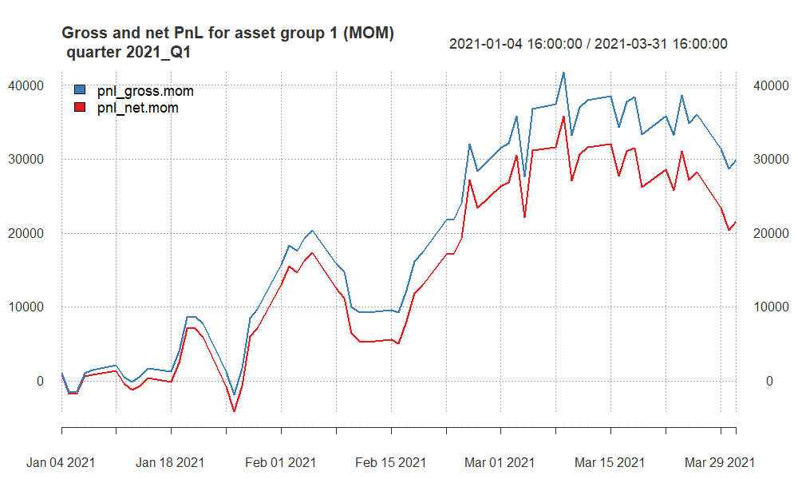

```

-   **Profit and Loss Tracking**: The blue line tracks the gross PnL, which shows the profit or loss before transaction costs. The red line tracks the net PnL, which is the profit or loss after accounting for a transaction cost of \$10 per trade.

-   **Quarterly Peaks and Troughs**: The highest peak in mid-March shows the point at which the strategy was most profitable before a subsequent decline. This could indicate a strong market movement that was successfully captured by the strategy before a reversal or increased market volatility.

-   **End-of-Quarter Performance**: Both PnL lines decline towards the end of the quarter, with the net PnL (red line) showing a steeper decline. This suggests that while the strategy was still profitable, the profits were reduced by transaction costs and possibly other factors such as unfavorable market movements or slippage.

## PnL of results for **group 1** -- quarter 2021Q3

```{r, echo = F, out.width ='100%'}
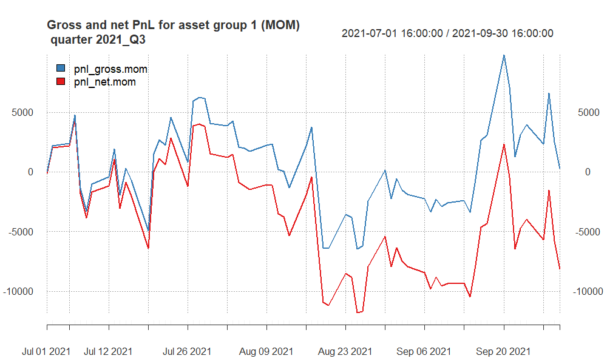

```

-   **Fluctuations**: Both lines show significant fluctuations, indicating a volatile performance throughout the quarter.

-   **Peaks and Troughs**: There are several peaks and troughs in both lines, suggesting that the strategy had periods of both gains and losses.

-   **Transaction Costs Impact**: The red line is consistently below the blue line, reflecting the impact of transaction costs on the strategy's profitability.

-   **Recovery and Decline**: The last part of the quarter shows a sharp increase in gross PnL followed by a steep decline, which is mirrored in the net PnL though the decline brings the net PnL below zero, indicating that the strategy ended the quarter at a loss after costs.

-   **End of Quarter**: The quarter ends with the gross PnL above zero, suggesting some level of profitability before costs, while the net PnL is negative, showing a loss after costs.

In short, the trading strategy experienced a tumultuous quarter with volatile performance and ended with a gross profit that was overshadowed by a net loss when accounting for transaction costs.

## PnL of results for **group 1** -- quarter 2021Q4

```{r, echo = F, out.width ='100%'}
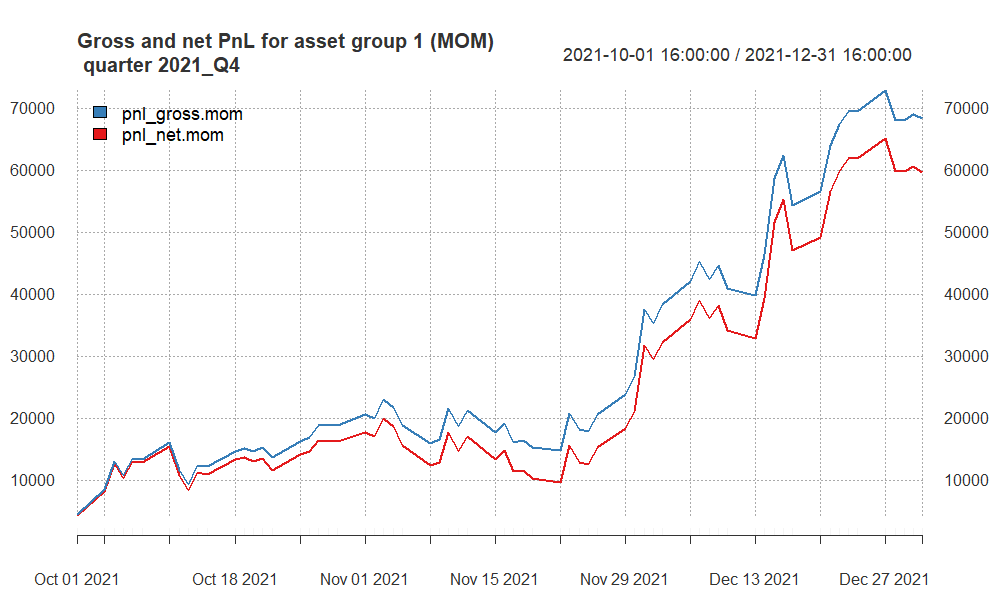

```

-   **Overall Trend**: Both the gross PnL (blue line) and net PnL (red line) exhibit a generally upward trend throughout the quarter, indicating that the trading strategy was profitable over this period.

-   **PnL Growth**: Starting from October, the PnL steadily grows, with both gross and net figures showing an increase, suggesting that the strategy was consistently generating positive returns.

-   **Transaction Cost Impact**: The gap between the gross and net PnL lines represents the impact of transaction costs. While both lines trend upwards, the net PnL is consistently lower than the gross PnL, which is expected due to the cost of trades.

-   **End-of-Quarter Performance**: The strategy's performance seems to peak towards the end of December, with the gross PnL reaching the highest point in the quarter. The net PnL also reaches a peak, although it is slightly lower due to transaction costs.

-   **Concluding Performance**: The quarter concludes with a high gross profit and a slightly lower net profit, demonstrating the success of the strategy after accounting for transaction costs.

This quarter appears to have been particularly successful for the trading strategy with the EMA55 and EMA80 crossover signals resulting in significant profitability.

## PnL of results for **group 1** -- quarter 2022Q2

```{r, echo = F, out.width ='100%'}
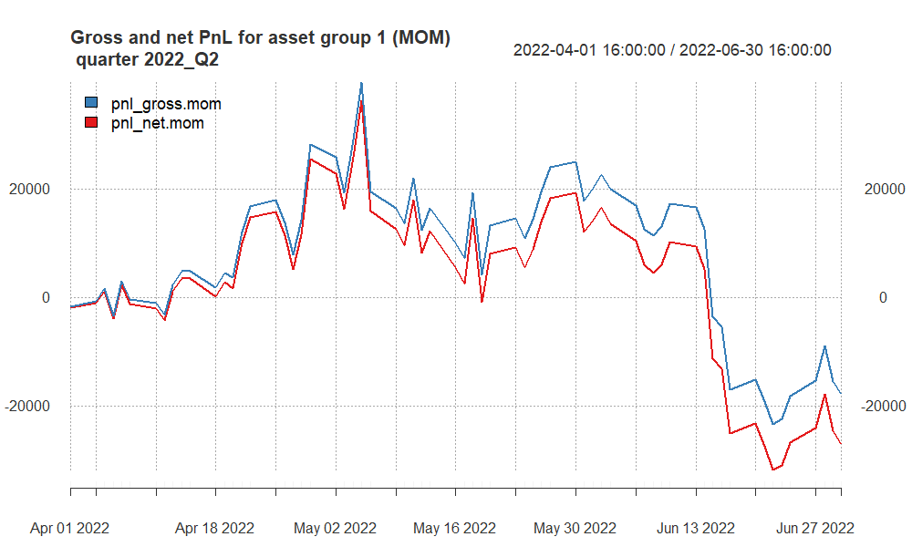

```

-   **Volatility**: There is considerable volatility throughout the quarter, with both profits and losses.

-   **Gross PnL (Blue Line)**: Shows a fluctuating performance with moments of profit that are later offset by losses, ending the quarter in negative territory.

-   **Net PnL (Red Line)**: Indicates the strategy's performance after accounting for transaction costs. The net PnL follows the gross PnL but ends lower due to the costs, accentuating the losses towards the end of the quarter.

-   **Trend**: Both lines trend downwards towards the end of the quarter, suggesting that the strategy was less effective during this period, or market conditions were not favorable for the EMA crossover strategy employed.

In summary, the trading strategy had a challenging quarter, with the net outcome reflecting a loss after accounting for transaction costs.

## PnL of results for **group 1** -- quarter 2022Q4

```{r, echo = F, out.width ='100%'}
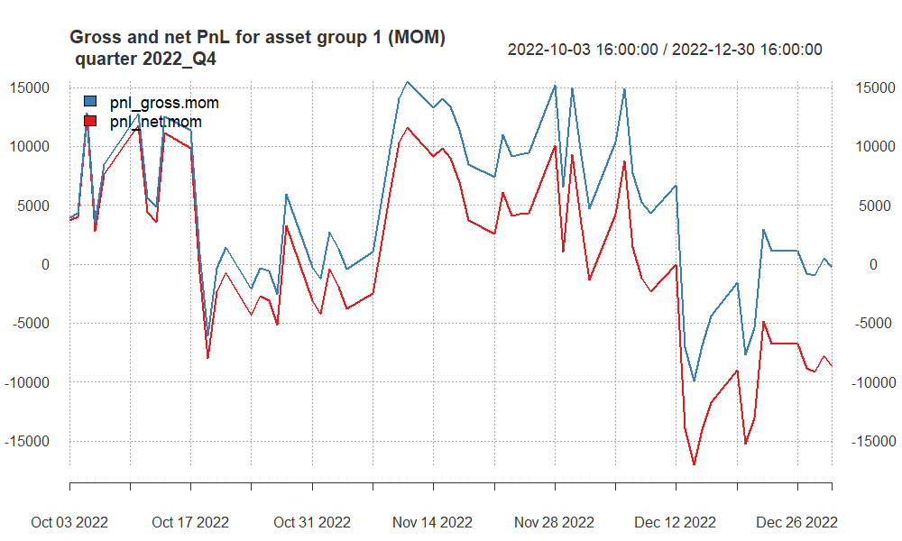

```

-   **PnL Fluctuations**: Both the gross (blue line) and net (red line) PnL demonstrate significant swings throughout the quarter, indicating a high level of volatility in the strategy's performance.

-   **Transaction Costs Impact**: The net PnL is consistently below the gross PnL, reflecting the impact of transaction costs on the strategy's profitability.

-   **Mid-Quarter Recovery**: After an initial dip into negative territory, both lines show a recovery, with the gross PnL reaching a peak around mid-quarter before declining again.

-   **Quarter End Decline**: Towards the end of the quarter, both PnL lines trend downwards, with the net PnL showing a larger drop into negative territory, suggesting the strategy incurred losses that were exacerbated after accounting for transaction costs.

In summary, the trading strategy had periods of profitability during the quarter but ultimately concluded with a downturn, resulting in a net loss as of the end of the quarter.

## PnL of results for **group 1** -- quarter 2023Q1

```{r, echo = F, out.width ='100%'}
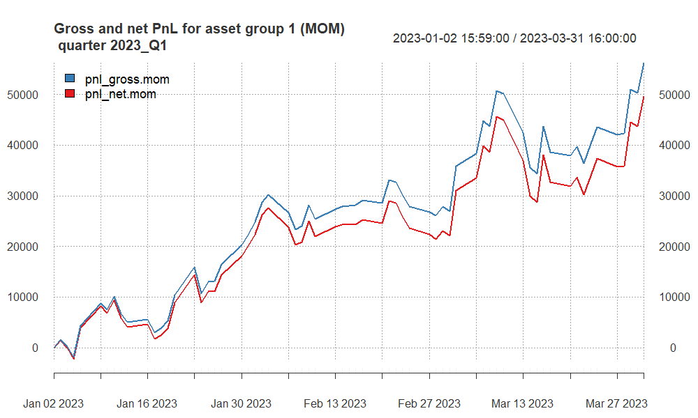

```

-   **Upward Trend**: Both the gross (blue line) and net (red line) PnL show an overall upward trend, indicating that the trading strategy was generally profitable during this period.

-   **Transaction Costs Impact**: The net PnL, while following the same general trend as the gross PnL, is consistently lower, which reflects the impact of transaction costs on the trading returns.

-   **Steady Performance Growth**: The strategy's performance appears to improve steadily over the quarter, with some fluctuations, but the upward trajectory is maintained.

-   **End-of-Quarter Performance**: The quarter concludes with both the gross and net PnL reaching their highest points, suggesting a strong finish for the trading strategy.

In summary, the EMA55 and EMA80 crossover strategy applied to NQ and SP futures resulted in a profitable first quarter in 2023, despite the costs associated with trading.

## PnL of results for **group 1** -- quarter 2023Q2

```{r, echo = F, out.width ='100%'}
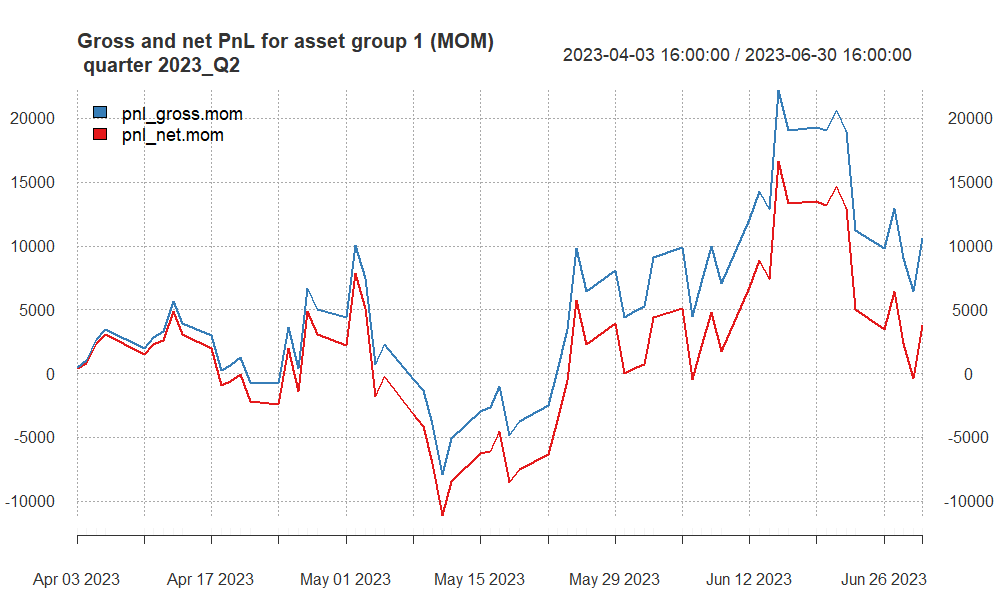

```

-   **Fluctuating Performance**: The graph shows significant swings in both gross (blue line) and net (red line) PnL, indicating a volatile performance throughout the quarter.

-   **Impact of Transaction Costs**: There is a clear gap between the gross and net PnL, demonstrating the effect of transaction costs on the strategy's profitability.

-   **Mid-Quarter Volatility**: The strategy experiences substantial ups and downs in the middle of the quarter, with a notable peak followed by a sharp decline in both gross and net PnL.

-   **Quarter Conclusion**: The quarter ends with a downward trend in both lines, although the gross PnL remains above zero, while the net PnL dips below, reflecting a period of losses, especially after accounting for transaction costs.

In summary, the trading strategy had a challenging second quarter in 2023 with high volatility and an overall decline in profitability, particularly after transaction costs are considered.

## Finally selected strategy for **group 2**

**WHY Specific EMA Settings for Each Asset:**

1. **AUD Strategy (EMA30 and EMA70)**: The AUD market is known for its correlation with commodity price movements and can exhibit trend shifts relatively quickly. The EMA30 provides a responsive indicator to pick up on these changes, while the EMA70 offers a longer-term trend perspective, enhancing the robustness of the signal by filtering out short-term fluctuations.

2. **CAD Strategy (EMA40 and EMA70)**: The CAD, often influenced by oil prices and North American economic indicators, requires a balance between responsiveness and long-term trend analysis. The EMA40 is chosen to react to market changes that are significant enough to consider, while still allowing the EMA70 to confirm the longer-term trend direction.

3. **XAG Strategy (EMA50 and EMA80)**: Silver markets can be volatile with extended trends due to industrial demand and investment flows. The EMA50 offers a medium-term view that is less susceptible to rapid market changes, while the EMA80 provides a solid baseline for the market's overall direction, making it suitable for capturing longer and sustained trends in the XAG market.

**Elimination of Gold (XAU) Futures:** 
***(WHY?)***

1. **Higher Transaction Costs**: With a transaction cost of $12, trading gold futures is more expensive compared to other assets. This higher cost can significantly eat into the profits, especially in a strategy that relies on EMA crossovers, which may generate a higher number of trades.

2. **Point Value Sensitivity**: The point value of \$100 for gold futures signifies that each point movement represents a \$100 change in value. This can lead to high volatility in PnL, which, when coupled with high transaction costs, not align with the risk management parameters of the strategy.

3. **Strategy Performance**: Historical performance data for the gold futures within the context of this strategy indicated underperformance compared to AUD, CAD, and XAG. This could be due to the less effective application of the selected EMA periods or the asset's characteristics not fitting well with the strategy's design.

In conclusion, the tailored EMA settings for AUD, CAD, and XAG are designed to align with each market's specific characteristics and volatility profiles, aiming to optimize the strategy's effectiveness. The exclusion of XAU futures is a strategic choice to enhance overall performance, manage costs, and maintain the strategy's risk profile within acceptable parameters.

```{=html}
<!-- here you can include code chunk that applies the strategy for group 1 and calculates all the summary statistics
-->
```
```{r, echo = F, warning = F, message = F}
# here you can refer to the R codes that apply the strategy
# for asset group 2 to all quarters (in a loop)

source("apply_my_strategy_group2.R")
```

## Summary of results for **group 2**

```{r, echo = F}
names(quarter_stats.all.group2)[5] <- "av.ntrades"
column_spec(
kable_styling(kable(quarter_stats.all.group2[, -2], 
                    "html", 
                    digits = 2,
                    align = "r"),
             font_size = 20),
1:7, width = "30em")

# more options here:
# https://haozhu233.github.io/kableExtra/awesome_table_in_html.html
```

-   **2021_Q1 and 2021_Q4**: These quarters show substantial negative values across all risk-adjusted performance metrics and PnL. This indicates significant underperformance both before and after costs.

-   **2021_Q3**: This quarter stands out with positive performance across all metrics and a substantial positive net PnL, suggesting the strategy worked well during this period.

-   **2022_Q2, 2022_Q4, and 2023_Q2**: All these quarters show negative performance, with the strategy incurring losses that were magnified after accounting for costs.

-   **2023_Q1**: This quarter shows a modest positive outcome, indicating a period of recovery or successful trading, though the gains are relatively small compared to the losses in other quarters.

## PnL of results for **group 2** -- quarter 2021Q1

```{r, echo = F, out.width ='100%'}
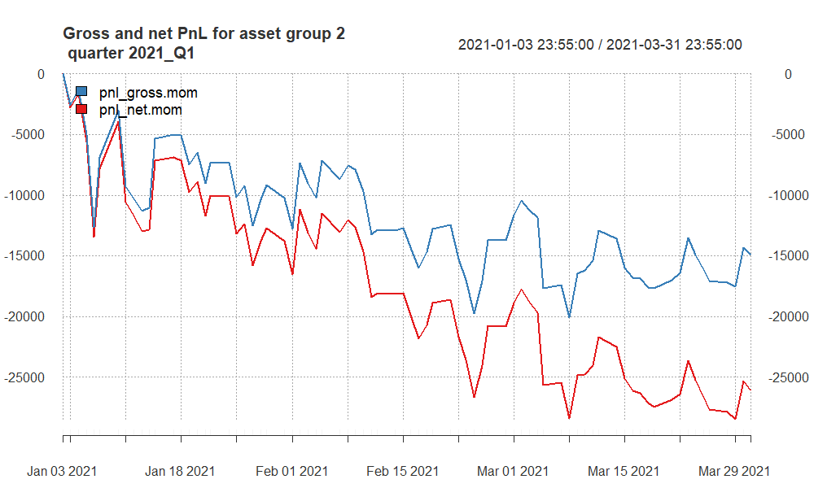

```

-   **Overall Downward Trend**: Both the gross and net PnL are trending downwards over the quarter, indicating that the strategy was generally unprofitable during this time.

-   **Impact of Transaction Costs**: The net PnL is consistently below the gross PnL, highlighting the impact of transaction costs. Given the negative values, these costs have exacerbated the losses.

-   **Volatility**: The strategy's PnL displays volatility, with several peaks and troughs, but the general direction is negative, suggesting that any gains were temporary and ultimately overtaken by losses.

-   **Quarterly Performance**: The quarter ends with both PnL measures near their lowest points, which suggests that not only did the strategy incur losses, but those losses increased towards the end of the period.

## PnL of results for **group 2** -- quarter 2021Q3

```{r, echo = F, out.width ='100%'}
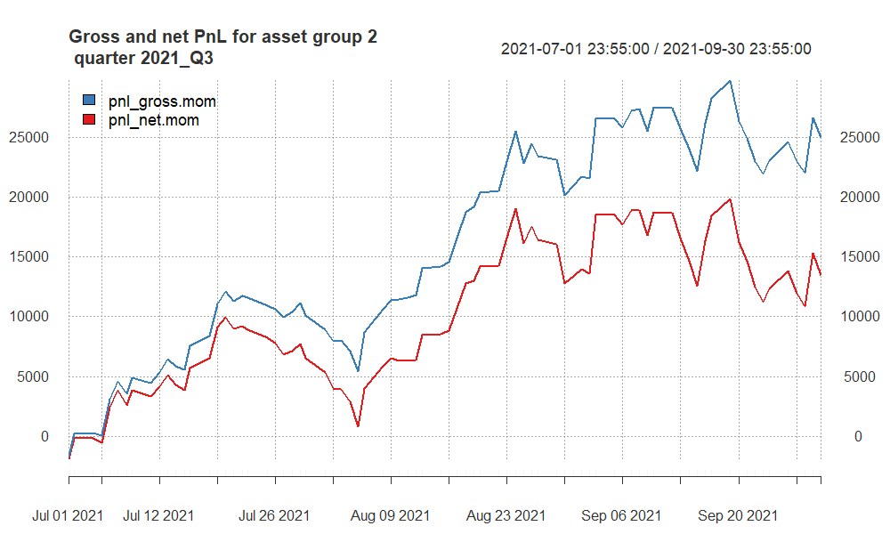

```

-   **Transaction Costs Impact**: The difference between the gross and net PnL lines shows that transaction costs have a significant impact on the strategy's returns. The net PnL is always below the gross PnL, which is expected due to the transaction fees associated with each trade.

-   **Quarterly Performance**: The strategy starts the quarter with positive momentum, experiences some volatility with ups and downs but maintains an overall positive trajectory. Both the gross and net PnL reach their highest points towards the end of the quarter, suggesting a period of strong performance.

-   **Volatility**: Despite the positive trend, there are periods of decline where the strategy gives back some of its gains, but these are followed by recoveries. This indicates some level of risk and the need for careful risk management.

In summary, the third quarter of 2021 was profitable for this trading strategy across the AUD, CAD, and XAG futures markets, even after accounting for transaction costs, although the impact of these costs is evident. The strategy's ability to end the quarter on an upward trend suggests effective management and the potential alignment of market conditions with the strategy's parameters during this period.

## PnL of results for **group 2** -- quarter 2021Q4

```{r, echo = F, out.width ='100%'}
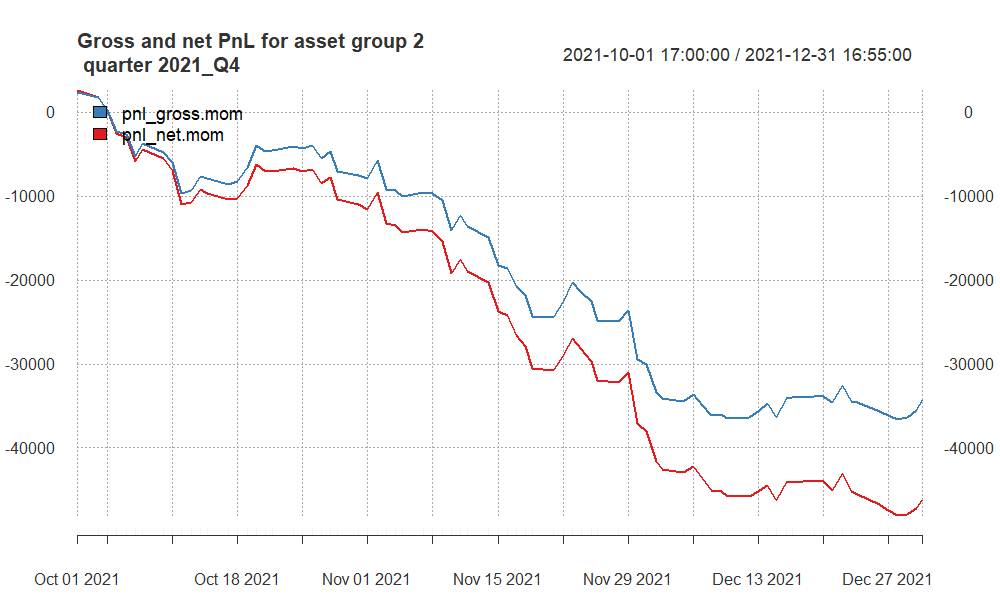

```

-   **Downward Trend**: Both the gross (blue line) and net (red line) PnL are trending downwards throughout the quarter, indicating that the trading strategy was consistently losing money over this period.

-   **Impact of Transaction Costs**: The net PnL shows a greater loss than the gross PnL, which suggests that transaction costs are exacerbating the losses experienced by the trading strategy.

-   **Consistent Underperformance**: The lack of any sustained periods of recovery in the PnL lines implies that the strategy did not align well with market conditions during this quarter.

## PnL of results for **group 2** -- quarter 2022Q2

```{r, echo = F, out.width ='100%'}
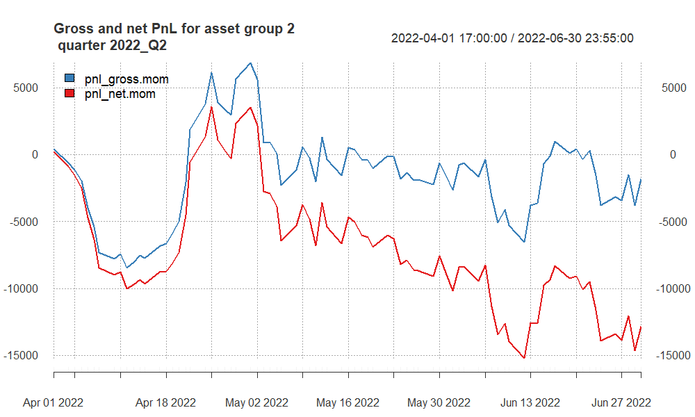

```

-   **Initial Losses and Recovery**: The quarter starts with significant losses, as indicated by both the gross (blue line) and net (red line) PnL dipping sharply. However, there is a recovery midway through the quarter, where the losses are recovered, and the PnL moves back above zero.

-   **Volatility**: The strategy shows a volatile performance throughout the quarter, with several peaks and valleys, indicating periods of gains and losses.

-   **Impact of Transaction Costs**: The net PnL is consistently below the gross PnL, which is indicative of the transaction costs that are being subtracted from the gross profits. This gap between the two lines represents the cost of executing trades within the strategy.

-   **End-of-Quarter Performance**: The quarter appears to end with a slight recovery in gross PnL, but the net PnL remains negative, suggesting that while the strategy had moments of profitability, the transaction costs ultimately resulted in a net loss.

## PnL of results for **group 2** -- quarter 2022Q4

```{r, echo = F, out.width ='100%'}
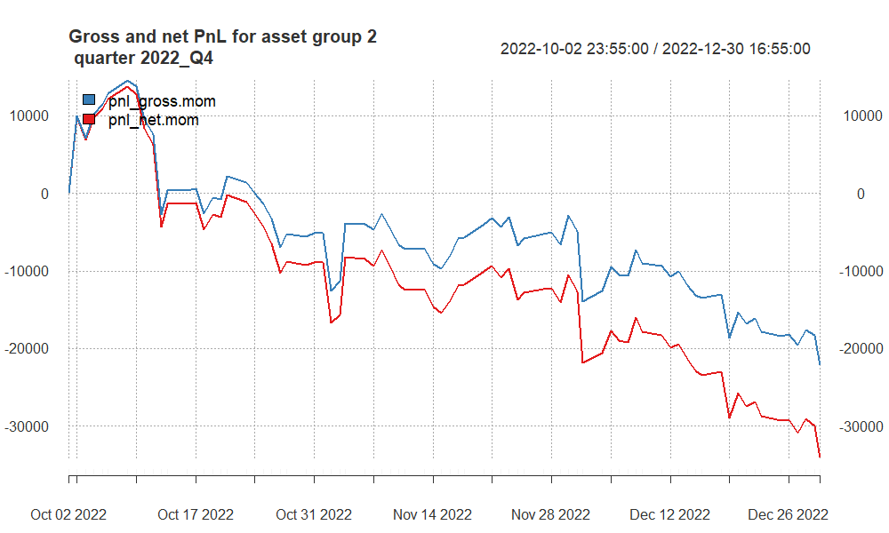

```

The strategy ends the quarter at a low point for both gross and net PnL, suggesting that the trading conditions, market volatility, or the strategy's parameters were not favorable during this period.

In brief, the trading strategy for AUD, CAD, and XAG futures faced a challenging quarter, with a consistent downward trend leading to significant losses, particularly after accounting for transaction costs.

## PnL of results for **group 2** -- quarter 2023Q1

```{r, echo = F, out.width ='100%'}
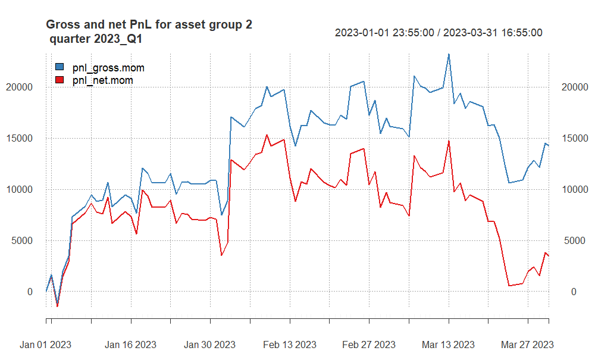

```

-   **Mixed Performance**: The trading strategy exhibits a mixed performance throughout the quarter. The gross PnL (blue line) fluctuates and has several peaks and valleys, indicating periods of profit and loss.

-   **Net PnL Trend**: The net PnL follows the trend of the gross PnL but remains below it, reflecting the reduction in profits due to transaction costs. Towards the end of the quarter, the net PnL shows a significant decline, ending the quarter at a lower point than where it started.

-   **End of Quarter**: Both lines end the quarter on a downward note, with the net PnL indicating that the strategy incurred losses after accounting for transaction costs.

In summary, the first quarter of 2023 was volatile for the trading strategy across AUD, CAD, and XAG futures. Despite some profitable moments, the strategy ultimately closed the quarter with a net loss, particularly impacted by transaction costs.

## PnL of results for **group 2** -- quarter 2023Q2

```{r, echo = F, out.width ='100%'}
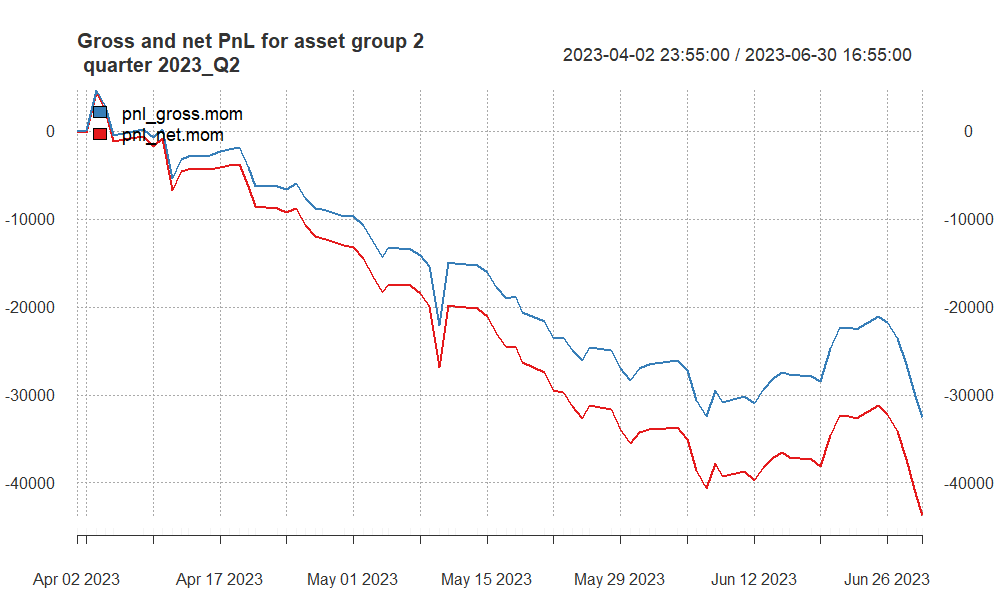

```

-   **Mid-Quarter Fluctuations**: While there are some recoveries and upward movements mid-quarter, these are not sustained, and the trend continues downward.

-   **End-of-Quarter Drop**: The quarter ends with a sharp decline in both gross and net PnL, with the net PnL experiencing a steeper fall, which highlights increased losses after accounting for transaction costs.

In summary, the trading strategy for AUD, CAD, and XAG futures struggled during the second quarter of 2023, with an overall negative performance and substantial losses, especially after considering the costs associated with trading.

# Summary and conclusions

## Group 1:

-   **2021 Q3**: The strategy exhibited significant volatility with a net performance that ultimately led to losses after transaction costs, despite some periods of profitability.

-   **2021 Q4**: This quarter was marked by a strong performance with both gross and net PnL achieving substantial growth and ending the quarter on a high note, indicating a successful period for the strategy.

-   **2022 Q2**: The trading strategy faced a difficult quarter with high volatility and a net loss by the quarter's end, suggesting challenges in market conditions or the strategy's execution.

-   **2022 Q4**: The performance was again volatile and ended with the strategy incurring a net loss, with transaction costs likely exacerbating the impact of losing trades.

-   **2023 Q1**: The strategy's performance improved significantly, with both gross and net PnL showing a steady and sustained upward trend throughout the quarter, concluding with high profitability.

-   **2023 Q2**: The most recent quarter showed high volatility with performance peaks mid-quarter but ended with a downturn, resulting in net PnL dipping into negative territory.

***Overall,*** the strategy's performance has varied significantly from quarter to quarter. While there were periods of considerable profit, particularly in Q4 of 2021 and Q1 of 2023, other quarters saw the strategy struggle to maintain profitability, especially when factoring in transaction costs.

## Group 2:

-   **2021 Q1**: The strategy began with a downtrend, ending the quarter with significant losses in both gross and net PnL, which were exacerbated by transaction costs.

-   **2021 Q3**: There was a remarkable turnaround, with both gross and net PnL showing an overall upward trend and the quarter closing on a profitable note despite the impact of transaction costs.

-   **2021 Q4**: The strategy suffered considerable losses, with both gross and net PnL in a consistent decline throughout the quarter, suggesting the strategy was not aligned with market conditions.

-   **2022 Q2**: The quarter started with large losses, recovered midway but still showed significant volatility and ended with a net loss after transaction costs were considered.

-   **2022 Q4**: The performance continued to struggle, showing a consistent downward trend and substantial losses, especially after accounting for transaction costs.

-   **2023 Q1**: The strategy's performance was mixed with several fluctuations, yet it maintained an upward trend in gross PnL. However, net PnL ended the quarter with a downturn.

-   **2023 Q2**: This quarter saw a continuous decline in performance, with both gross and net PnL ending the quarter with steep losses.

***Overall,*** the trading strategy across AUD, CAD, and XAG futures has experienced significant fluctuations from quarter to quarter. While there was a notable high point in 2021 Q3, the overall trend across the periods suggests challenges in maintaining consistent profitability.
