## Approaches undertaken

**Group 1:**

The trading strategy for the S&P 500 (SP) and NASDAQ (NQ) indices employs a technical analysis approach utilizing Exponential Moving Averages (EMAs) to identify potential entry and exit points. This strategy specifically leverages the EMA55 and EMA80 as key indicators to capture medium to long-term trends and to smooth out market noise, allowing for a more reliable analysis of the market's direction.

**Group 2:**

The trading strategy for the Australian Dollar (AUD), Canadian Dollar (CAD), and Silver (XAG) futures markets incorporates a methodical approach using Exponential Moving Averages (EMAs) to discern and capitalize on market trends. Each asset within this strategy utilizes a tailored set of EMA periods to reflect its unique market behavior and liquidity characteristics, with the AUD employing EMA30 and EMA70, the CAD using EMA40 and EMA70, and the XAG leveraging EMA50 and EMA80.

-   The **AUD (EMA30 and EMA70)** and **CAD (EMA40 and EMA70)** strategies, with their lower period EMAs, may generate more trading signals and could potentially capture trends quicker.

    -   **AUD Strategy (EMA30 and EMA70)** - This strategy involves using a faster 30-period EMA and a slower 70-period EMA to generate trade signals for the Australian dollar futures. Each trade has a transaction cost of \$7, and the point value is \$100,000. For this strategy to break even on a round-trip trade, it needs to capture a movement of at least 0.00007 in the AUD futures price (since \$7 is the cost for a \$100,000 point value).
    -   **CAD Strategy (EMA40 and EMA70)** - The Canadian dollar futures trading uses a 40-period EMA and a 70-period EMA. Similar to the AUD, the transaction cost is \$7 per trade, and the point value is \$100,000. The break-even price movement for the CAD is the same as for the AUD, at 0.00007.

-   The **XAG (EMA50 and EMA80)** strategy, with its higher period EMAs, would be slower to react to price movements, potentially reducing the number of trades and false signals.

    -   The silver futures trading strategy uses a 50-period EMA and an 80-period EMA. The transaction cost is \$7, and the point value is \$5,000. To cover the cost of a round-trip trade, the XAG price must move at least 0.0014 points (\$7/\$5,000).

# Finally selected strategy for **group 1**

The use of EMA55 and EMA80 suggests that a trade is initiated when the shorter EMA (55) crosses the longer EMA (80). If EMA55 crosses above EMA80, it might signal a buy, and if it crosses below, it might signal a sell.

The choice of EMA55 and EMA80 is strategic. The 55-period EMA is often used by traders because it represents a quarterly market cycle (considering a 5-day trading week and 13 weeks in a quarter). It serves as a barometer for intermediate trend direction. The 80-period EMA is chosen to provide an even longer-term perspective, aligning closely with market dynamics that span across multiple quarters, offering a balance between sensitivity and reliability.

**WHY EMA55 and EMA80?**

1.  **Risk Management**: By utilizing two EMAs with these specific periods, the strategy aims to minimize false signals that are often present in more reactive, short-term moving averages. This can help in avoiding the whipsaw effect in highly volatile markets like SP and NQ, where short-term movements can be erratic.

2.  **Trend Confirmation**: The EMA55 acts as a trend filter, helping to confirm the market's direction before positions are taken. When the market price is above the EMA55, it indicates a potential bullish trend, and conversely, when it is below, it may signal a bearish trend.

3.  **Signal Reinforcement**: The EMA80 reinforces signals given by the EMA55. A crossover of the EMA55 above the EMA80 may suggest a strong buy signal, whereas a crossover below may indicate a strong sell signal. This longer period EMA serves as a support or resistance level, providing a more substantial backdrop for decision-making.

4.  **Market Sentiment**: Both EMAs are significant not just for individual decision-making, but they are also watched by numerous market participants. Their common use across traders and institutions can create self-fulfilling prophecies, reinforcing the strength of the signals they provide.

5.  **Adaptability**: The EMA55 and EMA80 are responsive enough to adapt to market changes over a few weeks, which is crucial for capturing gains in the indices' futures market, while still being distant enough to filter out insignificant price movements.

In conclusion, the strategic application of EMA55 and EMA80 in trading the SP and NQ futures is designed to capitalize on sustained trends, reduce the impact of market volatility, and enhance the robustness of trade signals for improved decision-making in both bullish and bearish scenarios.

```{r, echo = F, warning = F, message = F}
# here you can refer to the R codes that apply the strategy
# for asset group 1 to all quarters (in a loop)

source("apply_my_strategy_group1.R")
```

## Summary of results for **group 1**

```{r, echo = F}
names(quarter_stats.all.group1)[5] <- "av.ntrades"
kable(quarter_stats.all.group1[, -c(2,5)], 
                    "markdown", 
                    digits = 2,
                    align = "r")

```

-   **2021_Q1**: The strategy started off strongly with positive gross and net Sharpe Ratios (SR) and Calmar Ratios (CR), indicating good risk-adjusted returns and a robust quarter with significant profits.

-   **2021_Q2**: This quarter marked a downturn, with negative SR and CR values, reflecting poor risk-adjusted performance and substantial losses in both gross and net PnL.

-   **2021_Q3**: Performance was mixed with a slight positive gross SR but negative net SR and CR, resulting in a minimal gross profit and a net loss.

-   **2021_Q4**: The strategy rebounded strongly with high positive SR and CR values and considerable profits, suggesting a highly successful quarter.

-   **2022_Q1**: Continued good performance from the previous quarter with positive SR and CR values and healthy profits.

-   **2022_Q2**: Performance dipped, indicated by negative SR and CR values, and the strategy incurred losses.

-   **2022_Q3**: The negative trend continued with slight losses, although less severe than the previous quarter.

-   **2022_Q4**: Very minor gross losses and more significant net losses were observed, with negative SR and CR values.

-   **2023_Q1**: A strong recovery with high SR and CR values and substantial profits.

-   **2023_Q2**: A positive quarter, albeit with lower SR and CR values compared to Q1, but still profitable.

-   **2023_Q3**: A challenging quarter with negative SR and CR values and significant losses in both gross and net PnL.

-   **2023_Q4**: An improvement with positive SR and CR values and profits, although at lower levels than earlier profitable quarters.

The strategy's performance shows some volatility from quarter to quarter, with periods of significant profits interspersed with quarters of losses. Risk-adjusted return metrics like SR and CR have fluctuated correspondingly, suggesting varying levels of market risk and strategy effectiveness. The strategy has demonstrated the ability to recover after downturns, but it has also faced consistent challenges, particularly in managing costs, as evidenced by the differences between gross and net returns. The sum of stats is 154.52.

## PnL of results for **group 1** -- quarter 2021Q1

```{r, echo = F, out.width ='90%'}
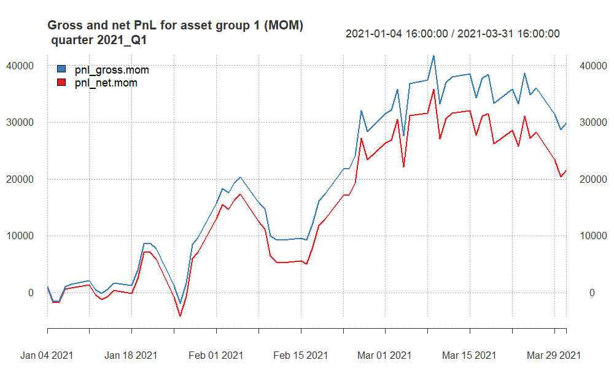

```

**Quarterly Peaks and Troughs**: The highest peak in mid-March shows the point at which the strategy was most profitable before a subsequent decline. This could indicate a strong market movement that was successfully captured by the strategy before a reversal or increased market volatility.

**End-of-Quarter Performance**: Both PnL lines decline towards the end of the quarter, with the net PnL showing a steeper decline. This suggests that while the strategy was still profitable, the profits were reduced by transaction costs and possibly other factors such as unfavorable market movements or slippage.

## PnL of results for **group 1** -- quarter 2021Q2

```{r, echo = F, out.width ='90%'}
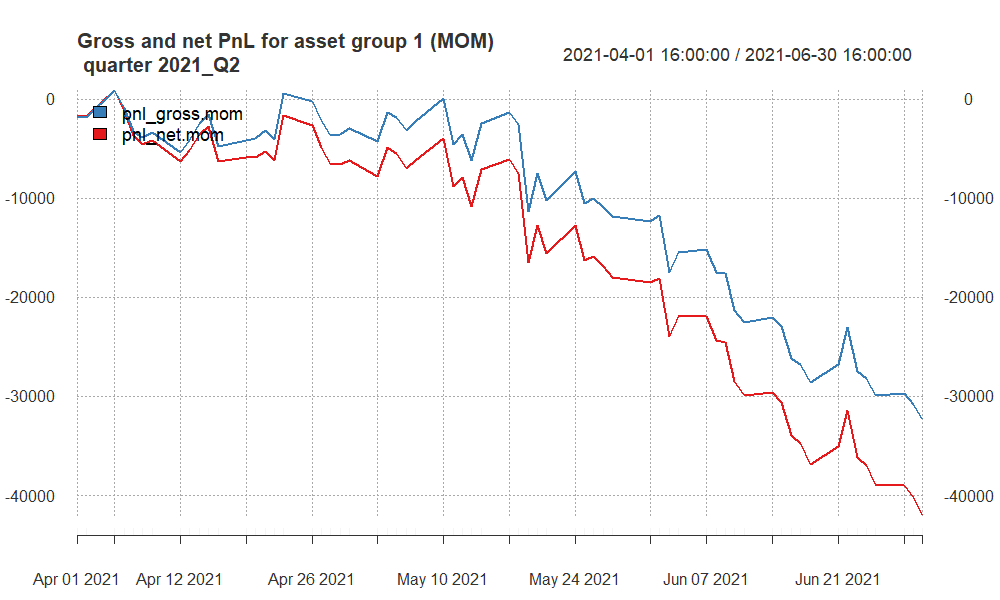

```

**Volatility**: Significant ups and downs in PnL suggest a volatile trading period.

**Inconsistency**: The presence of multiple peaks and troughs indicates inconsistent performance.

**Downtrend**: Both gross and net PnL trends downward, ending the quarter with losses, particularly more pronounced after including costs.

## PnL of results for **group 1** -- quarter 2021Q3

```{r, echo = F, out.width ='80%'}
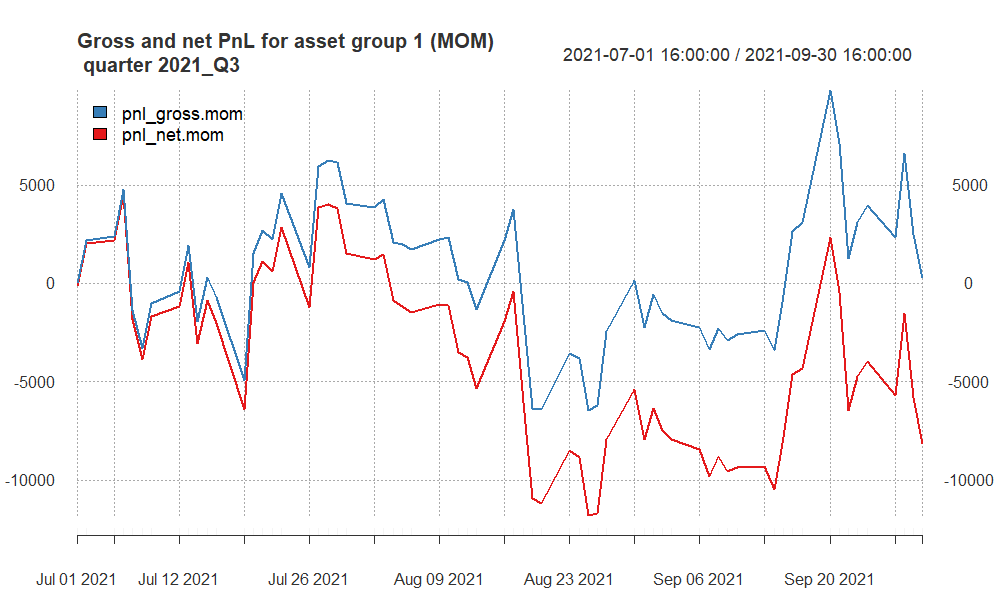

```

**Fluctuations**: Both lines show significant fluctuations, indicating a volatile performance throughout the quarter.

**Peaks and Troughs**: There are several peaks and troughs in both lines, suggesting that the strategy had periods of both gains and losses.

**Recovery and Decline**: The last part of the quarter shows a sharp increase in gross PnL followed by a steep decline, which is mirrored in the net PnL though the decline brings the net PnL below zero, indicating that the strategy ended the quarter at a loss after costs.

**End of Quarter**: The quarter ends with the gross PnL above zero, suggesting some level of profitability before costs, while the net PnL is negative, showing a loss after costs.

## PnL of results for **group 1** -- quarter 2021Q4

```{r, echo = F, out.width ='80%'}
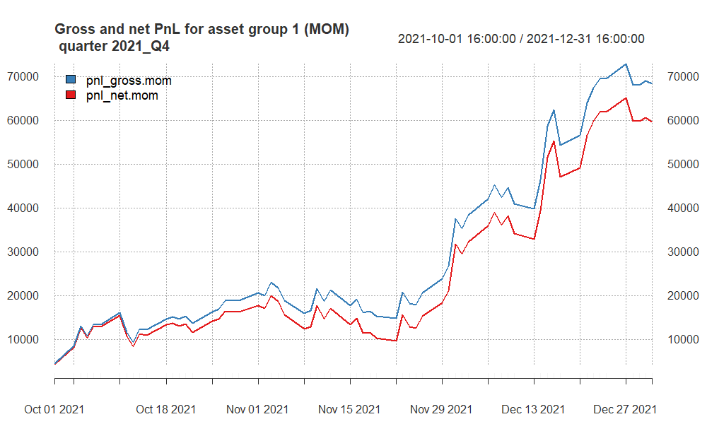

```

**Overall Trend**: Both the gross PnL and net PnL exhibit a generally upward trend throughout the quarter, indicating that the trading strategy was profitable over this period.

**PnL Growth**: Starting from October, the PnL steadily grows, with both gross and net figures showing an increase, suggesting that the strategy was consistently generating positive returns.

**End-of-Quarter Performance**: The strategy's performance seems to peak towards the end of December, with the gross PnL reaching the highest point in the quarter. The net PnL also reaches a peak, although it is slightly lower due to transaction costs.

**Concluding Performance**: The quarter concludes with a high gross profit and a slightly lower net profit, demonstrating the success of the strategy after accounting for transaction costs.

This quarter appears to have been ***particularly successful*** for the trading strategy with the EMA55 and EMA80 crossover signals resulting in significant profitability.

## PnL of results for **group 1** -- quarter 2022Q1

```{r, echo = F, out.width ='80%'}
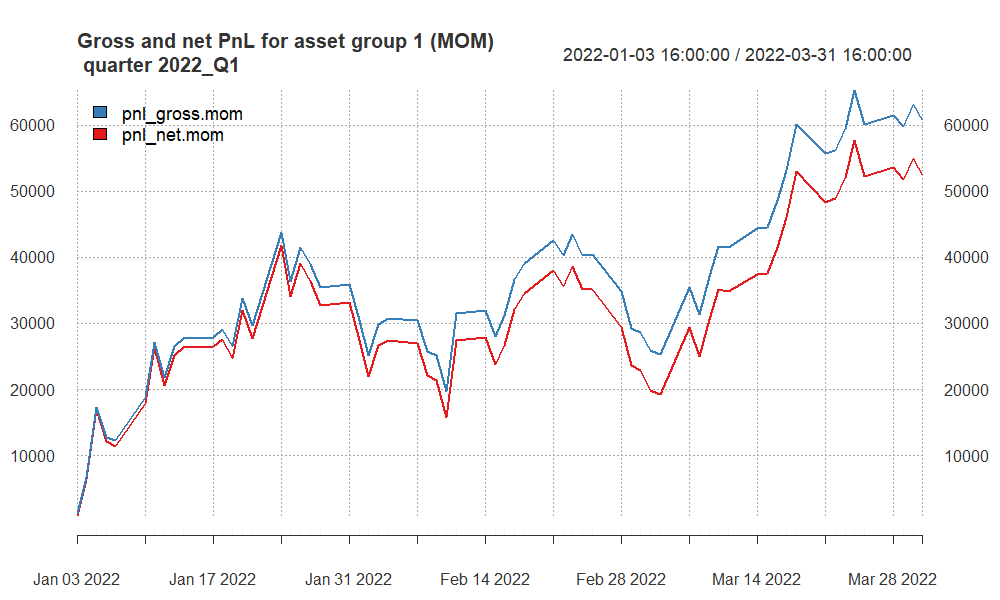

```

**Overall Uptrend**: Both gross and net PnL indicate an overall upward trend, suggesting profitable performance throughout the quarter.

**Fluctuations**: There are fluctuations, but the general direction is positive, with both lines showing growth over time.

**Dips and Recoveries**: Several dips are noticeable, but these are followed by recoveries, where the strategy regains and even surpasses previous levels.

**Gross vs. Net**: The gross PnL consistently remains above the net PnL, indicating that while profitable, the strategy incurs costs that affect its net profitability.

**Quarter End**: The strategy concludes Q1 2022 on a high note, with both gross and net PnL reaching their peaks for the quarter, although net PnL is noticeably lower due to costs.

## PnL of results for **group 1** -- quarter 2022Q2

```{r, echo = F, out.width ='80%'}
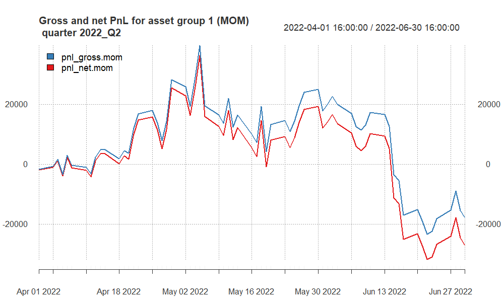

```

**Volatility**: There is considerable volatility throughout the quarter, with both profits and losses.

**Trend**: Both lines trend downwards towards the end of the quarter, suggesting that the strategy was less effective during this period, market conditions were not favorable for the EMA crossover strategy employed.

The trading strategy had a challenging quarter, with the net outcome reflecting a loss after accounting for transaction costs.

## PnL of results for **group 1** -- quarter 2022Q3

```{r, echo = F, out.width ='80%'}
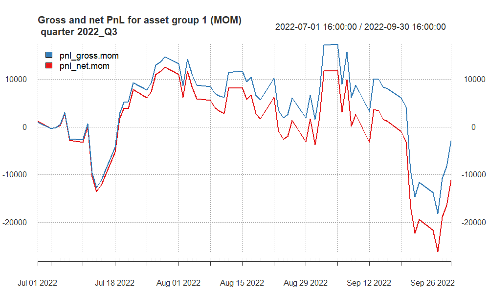

```

**Increased Volatility**: Both the gross and net PnL lines exhibit increased volatility compared to the previous quarter, with frequent and significant swings above and below the zero line.

**Peaks and Troughs**: The period is characterized by sharp rises and falls, suggesting erratic performance with periods of gains followed by losses.

**End of Quarter Decline**: The quarter ends with a steep decline in both gross and net PnL, with the net PnL falling further below zero due to costs, indicating that the strategy suffered significant losses towards the end of the quarter.

## PnL of results for **group 1** -- quarter 2022Q4

```{r, echo = F, out.width ='80%'}
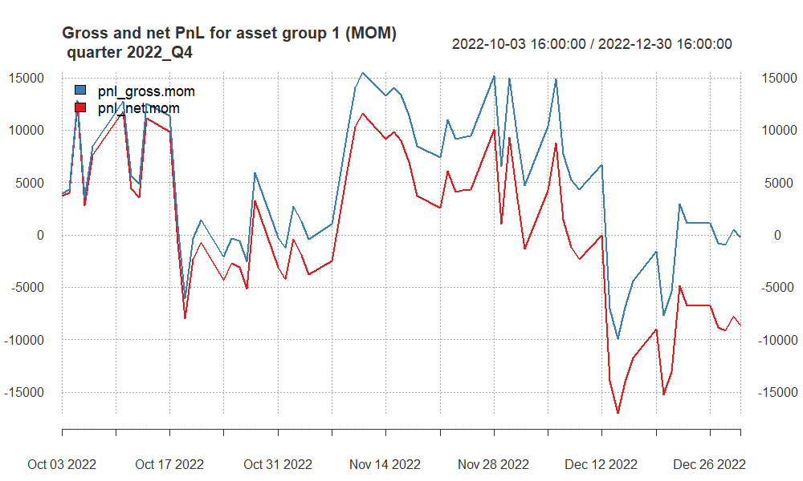

```

**PnL Fluctuations**: Both the gross and net PnL demonstrate significant swings throughout the quarter, indicating a high level of volatility in the strategy's performance.

**Mid-Quarter Recovery**: After an initial dip into negative territory, both lines show a recovery, with the gross PnL reaching a peak around mid-quarter before declining again.

**Quarter End Decline**: Towards the end of the quarter, both PnL lines trend downwards, with the net PnL showing a larger drop into negative territory, suggesting the strategy incurred losses that were exacerbated after accounting for transaction costs.

The trading strategy had periods of profitability during the quarter but ultimately concluded with a downturn, resulting in a net loss as of the end of the quarter.

## PnL of results for **group 1** -- quarter 2023Q1

```{r, echo = F, out.width ='80%'}
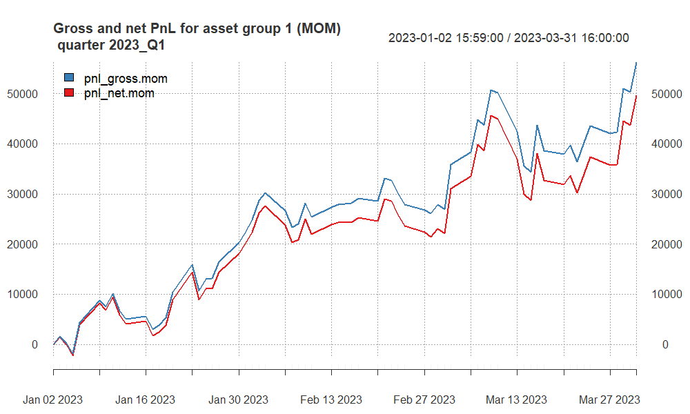

```

**Upward Trend**: Both the gross and net PnL show an overall upward trend, indicating that the trading strategy was *generally profitable* during this period.

**Steady Performance Growth**: The strategy's performance appears to improve steadily over the quarter, with some fluctuations, but the upward trajectory is maintained.

**End-of-Quarter Performance**: The quarter concludes with both the gross and net PnL reaching their highest points, suggesting a strong finish for the trading strategy.

The EMA55 and EMA80 crossover strategy applied to Group 1 futures resulted in a profitable first quarter in 2023, despite the costs associated with trading.

## PnL of results for **group 1** -- quarter 2023Q2

```{r, echo = F, out.width ='80%'}
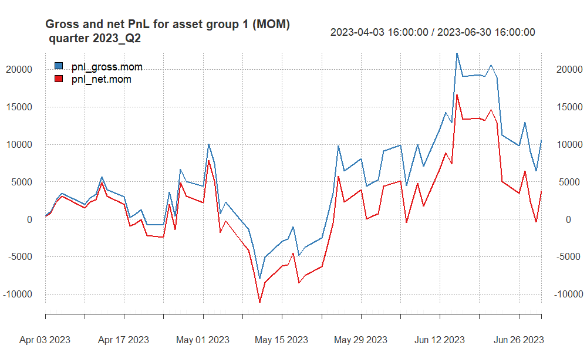

```

**Fluctuating Performance**: The graph shows significant swings in both gross and net PnL, indicating a volatile performance throughout the quarter.

**Mid-Quarter Volatility**: The strategy experiences substantial ups and downs in the middle of the quarter, with a notable peak followed by a sharp decline in both gross and net PnL.

**Quarter Conclusion**: The quarter ends with a downward trend in both lines, although the gross PnL remains above zero, while the net PnL dips below, reflecting a period of losses, especially after accounting for transaction costs.

The trading strategy had a challenging second quarter in 2023 with high volatility and an overall decline in profitability, particularly after transaction costs are considered.

## PnL of results for **group 1** -- quarter 2023Q3

```{r, echo = F, out.width ='80%'}
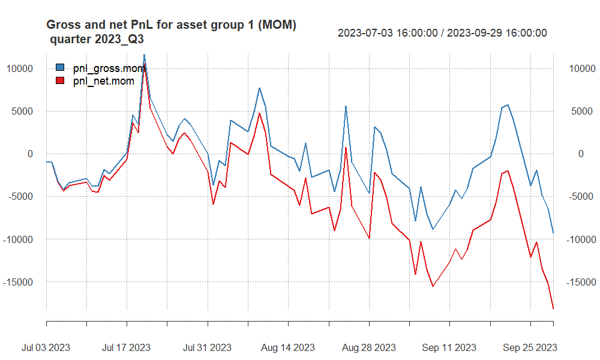

```

**Volatility**: The performance shows significant volatility, with both gross and net PnL frequently crossing the zero mark, indicating periods of gains and losses.

**Overall Downtrend**: There is a notable overall downward trend, especially towards the end of the quarter, with both PnL lines ending below zero.

**Quarter Conclusion**: The quarter concludes with a sharp decline in PnL, indicating that the strategy incurred substantial losses towards the end of the period.

## PnL of results for **group 1** -- quarter 2023Q4

```{r, echo = F, out.width ='80%'}
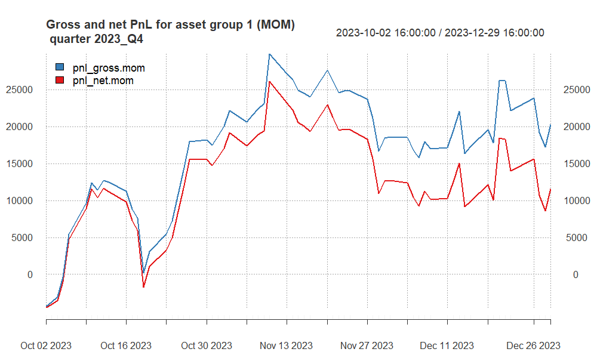

```

**Fluctuations**: The chart shows significant fluctuations in performance, with both gross and net PnL experiencing multiple peaks and troughs throughout the quarter.

**Recovery and Dips**: After an initial dip, both PnL lines recover well, but this is followed by several periods of decline and recovery, indicating an unstable market or inconsistent strategy performance.

**Quarter End**: The quarter ends with a decline in both gross and net PnL, although the gross PnL remains positive, indicating some level of profitability before costs are taken into account. However, the net PnL is notably lower, finishing closer to the zero line, which reflects the cost impact on the strategy's returns.

# Finally selected strategy for **group 2**

**WHY Specific EMA Settings for Each Asset:**

1.  **AUD Strategy (EMA30 and EMA70)**: The AUD market is known for its correlation with commodity price movements and can exhibit trend shifts relatively quickly. The EMA30 provides a responsive indicator to pick up on these changes, while the EMA70 offers a longer-term trend perspective, enhancing the robustness of the signal by filtering out short-term fluctuations.

2.  **CAD Strategy (EMA40 and EMA70)**: The CAD, often influenced by oil prices and North American economic indicators, requires a balance between responsiveness and long-term trend analysis. The EMA40 is chosen to react to market changes that are significant enough to consider, while still allowing the EMA70 to confirm the longer-term trend direction.

3.  **XAG Strategy (EMA50 and EMA80)**: Silver markets is volatile with extended trends due to industrial demand and investment flows. The EMA50 offers a medium-term view that is less susceptible to rapid market changes, while the EMA80 provides a solid baseline for the market's overall direction, making it suitable for capturing longer and sustained trends in the XAG market.

**Elimination of Gold (XAU) Futures:** ***(WHY?)***

1.  **Higher Transaction Costs**: With a transaction cost of \$12, trading gold futures is more expensive compared to other assets. This higher cost can significantly eat into the profits, especially in a strategy that relies on EMA crossovers, which may generate a higher number of trades.

2.  **Point Value Sensitivity**: The point value of \$100 for gold futures signifies that each point movement represents a \$100 change in value. This can lead to high volatility in PnL, which, when coupled with high transaction costs, not align with the risk management parameters of the strategy.

3.  **Strategy Performance**: Historical performance data for the gold futures within the context of this strategy indicated underperformance compared to AUD, CAD, and XAG. This could be due to the less effective application of the selected EMA periods or the asset's characteristics not fitting well with the strategy's design.

The tailored EMA settings for AUD, CAD, and XAG are designed to align with each market's specific characteristics and volatility profiles, aiming to optimize the strategy's effectiveness. The exclusion of XAU futures is a strategic choice to enhance overall performance, manage costs, and maintain the strategy's risk profile within acceptable parameters.

```{=html}
<!-- here you can include code chunk that applies the strategy for group 1 and calculates all the summary statistics
-->
```
```{r, echo = F, warning = F, message = F}
# here you can refer to the R codes that apply the strategy
# for asset group 2 to all quarters (in a loop)

source("apply_my_strategy_group2.R")
```

## Summary of results for **group 2**

```{r, echo = F}
names(quarter_stats.all.group2)[5] <- "av.ntrades"
kable(quarter_stats.all.group2[, -c(2,5)], 
                    "markdown", 
                    digits = 2,
                    align = "r")

```

-   The strategy had varying performance with predominantly negative Sharpe Ratios (SR) and Calmar Ratios (CR), suggesting risk-adjusted returns were often below acceptable thresholds.

-   **2021_Q3** was the standout quarter, showing positive gross and net SR and CR values and a significant profit, indicating a successful period for the strategy.

-   Most other quarters, including **2021_Q1**, **2021_Q2**, **2021_Q4**, **2022_Q1**, **2022_Q2**, **2022_Q4**, **2023_Q2**, **2023_Q3**, and **2023_Q4** experienced losses, as indicated by negative SR and CR values.

-   **2022_Q3** and **2023_Q1** showed mixed results with slight profits or minimal losses, suggesting these periods were relatively better than other loss-making quarters.

-   Overall, **2021_Q3** was the most profitable, and **2021_Q4** and **2023_Q2** were the most challenging for Group 2. The sum of stats is -69.17.

## PnL of results for **group 2** -- quarter 2021Q1

```{r, echo = F, out.width ='100%'}
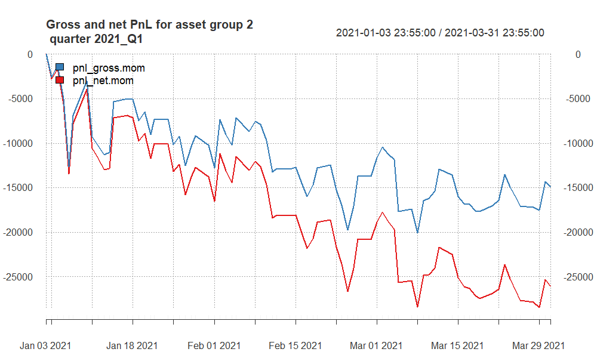

```

**Overall Downward Trend**: Both the gross and net PnL are trending downwards over the quarter, indicating that the strategy was generally unprofitable during this time.

**Volatility**: The strategy's PnL displays volatility, with several peaks and troughs, but the general direction is negative, suggesting that any gains were temporary and ultimately overtaken by losses.

**Quarterly Performance**: The quarter ends with both PnL measures near their lowest points, which suggests that not only did the strategy incur losses, but those losses increased towards the end of the period.

## PnL of results for **group 2** -- quarter 2021Q2

```{r, echo = F, out.width ='100%'}
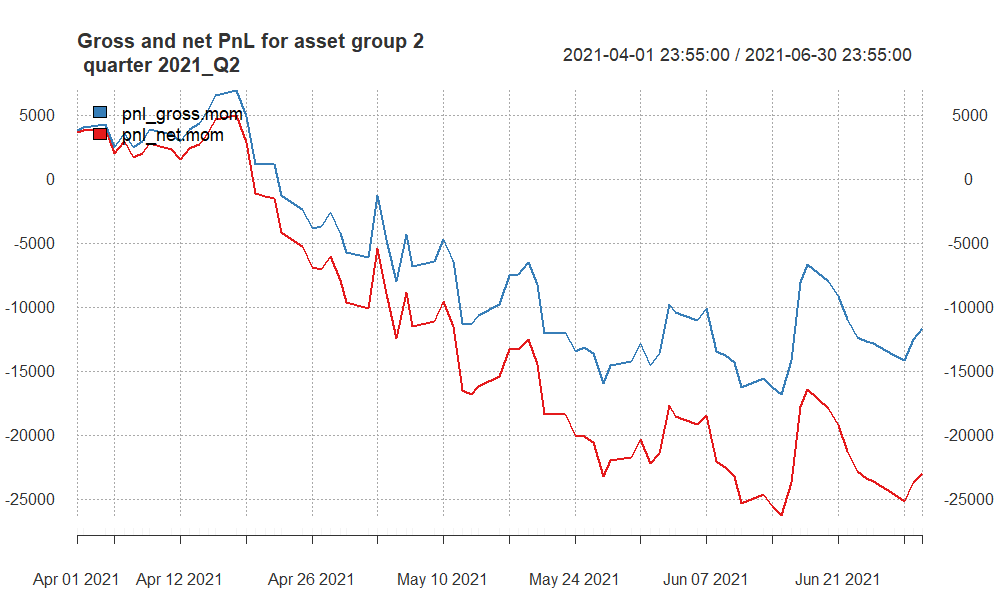

```

**Downtrend**: Both gross and net PnL lines are trending downwards, indicating that the strategy experienced overall losses during the quarter.

**Volatility**: The chart shows volatility, with several ups and downs, but the general trajectory is negative.

**Cost Impact**: The net PnL, after accounting for costs, is consistently below the gross PnL, highlighting the impact of trading expenses.

**Ending Lower**: The quarter concludes with both gross and net PnL at their lowest points, suggesting that the strategy underperformed throughout this period.

## PnL of results for **group 2** -- quarter 2021Q3

```{r, echo = F, out.width ='100%'}
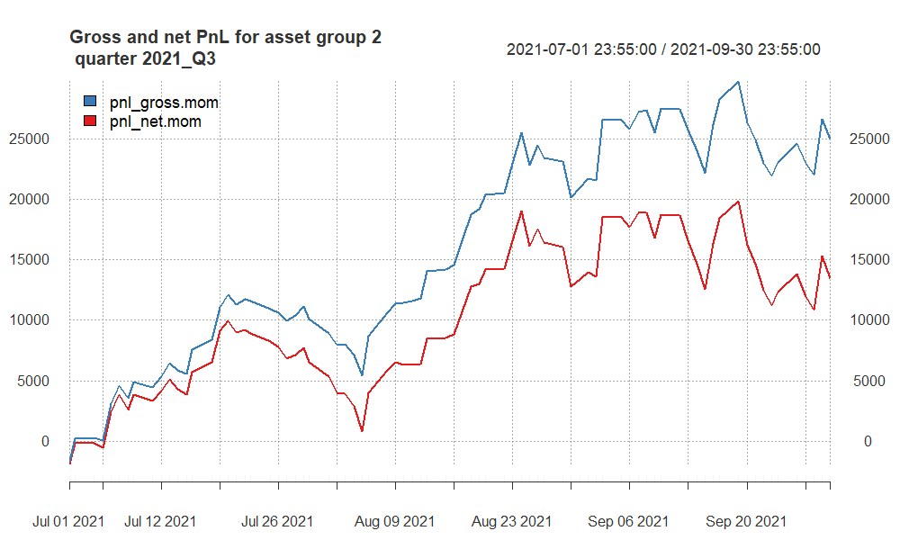

```

**Quarterly Performance**: The strategy starts the quarter with positive momentum, experiences some volatility with ups and downs but maintains an overall positive trajectory. Both the gross and net PnL reach their highest points towards the end of the quarter, suggesting a period of strong performance.

**Volatility**: Despite the positive trend, there are periods of decline where the strategy gives back some of its gains, but these are followed by recoveries.

The third quarter of 2021 was profitable for the trading strategy, even after accounting for transaction costs, although the impact of these costs is evident. The strategy's ability to end the quarter on an upward trend suggests effective management and the potential alignment of market conditions with the strategy's parameters during this period.

## PnL of results for **group 2** -- quarter 2021Q4

```{r, echo = F, out.width ='100%'}
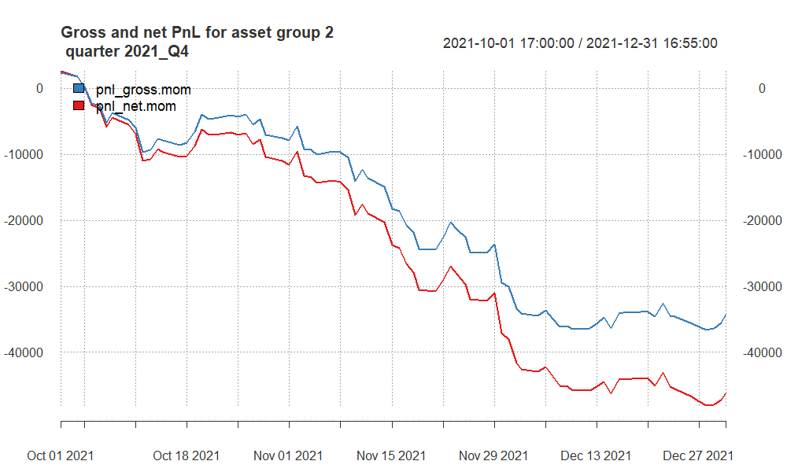

```

**Downward Trend**: Both the gross and net PnL are trending downwards throughout the quarter, indicating that the trading strategy was consistently losing money over this period.

**Consistent Underperformance**: The lack of any sustained periods of recovery in the PnL lines implies that the strategy did not align well with market conditions during this quarter.

## PnL of results for **group 2** -- quarter 2022Q1

```{r, echo = F, out.width ='100%'}
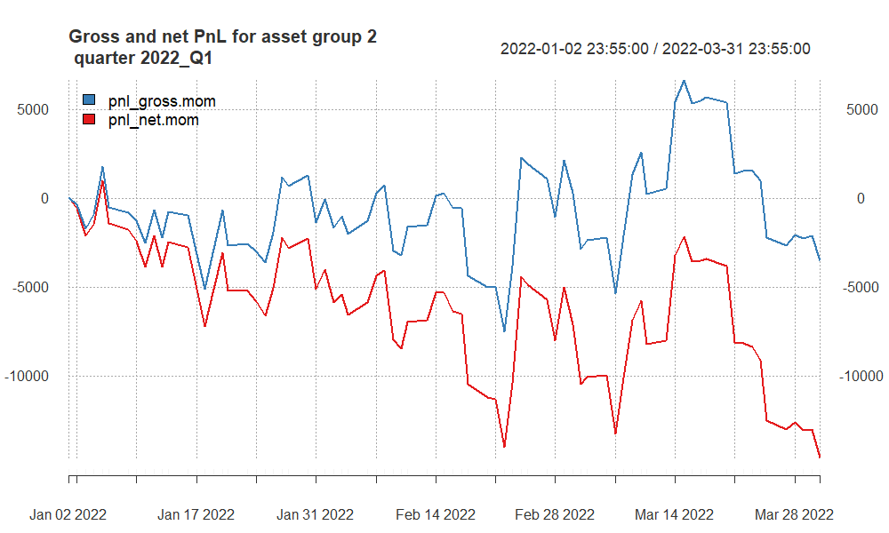

```

**Fluctuations**: There are multiple fluctuations in both gross and net PnL, suggesting a highly volatile trading period.

**Net Losses**: The net PnL remains below zero for the majority of the quarter, indicating that the strategy consistently incurred net losses after accounting for costs.

**Gross Performance**: The gross PnL fluctuates around the zero line, with periods of both positive and negative performance, but ends the quarter on a downward note.

**Cost Impact**: The difference between the gross and net PnL lines illustrates the impact of costs on the trading strategy's returns, with costs significantly affecting net profitability.

**Quarter End**: The quarter ends with a steep decline in both gross and net PnL, concluding the period with the strategy in a loss-making position.

## PnL of results for **group 2** -- quarter 2022Q2

```{r, echo = F, out.width ='100%'}
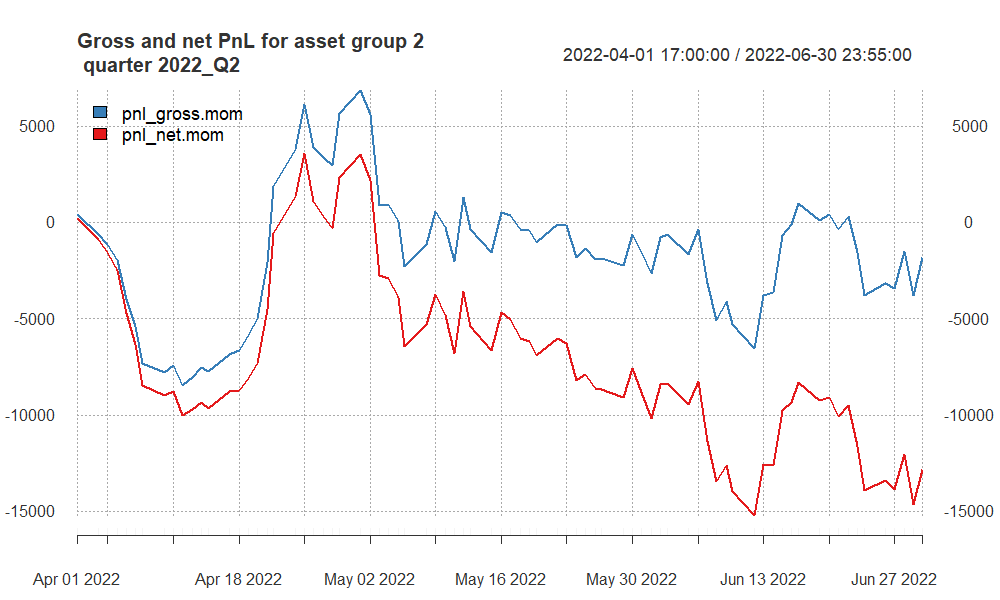

```

**Initial Losses and Recovery**: The quarter starts with significant losses, as indicated by both the gross and net PnL dipping sharply. However, there is a recovery midway through the quarter, where the losses are recovered, and the PnL moves back above zero.

**Volatility**: The strategy shows a volatile performance throughout the quarter, with several peaks and valleys, indicating periods of gains and losses.

**End-of-Quarter Performance**: The quarter appears to end with a slight recovery in gross PnL, but the net PnL remains negative, suggesting that while the strategy had moments of profitability, the transaction costs ultimately resulted in a net loss.

## PnL of results for **group 2** -- quarter 2022Q3

```{r, echo = F, out.width ='80%'}
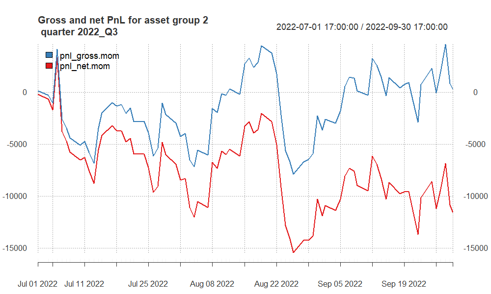

```

**Volatility**: Both the gross and net PnL demonstrate a volatile performance with several peaks and troughs.

**Partial Recoveries**: The strategy experiences some recoveries, as indicated by the upward swings in the gross PnL.

**Persistent Net Losses**: The net PnL remains below zero for the entirety of the quarter, suggesting that after costs, the strategy is consistently unprofitable.

**End of Quarter**: The quarter concludes with the gross PnL in positive territory, but the net PnL still shows a loss, indicating that while the strategy had periods of gross profitability, costs significantly affected its overall net performance.

## PnL of results for **group 2** -- quarter 2022Q4

```{r, echo = F, out.width ='80%'}
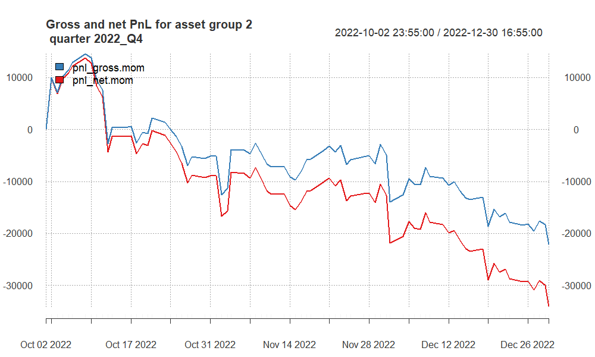

```

**End of Quarter**: The strategy ends the quarter at a low point for both gross and net PnL, suggesting that the trading conditions, market volatility, or the strategy's parameters were not favorable during this period.

In brief, the trading strategy faced a challenging quarter, with a consistent downward trend leading to significant losses, particularly after accounting for transaction costs.

## PnL of results for **group 2** -- quarter 2023Q1

```{r, echo = F, out.width ='80%'}
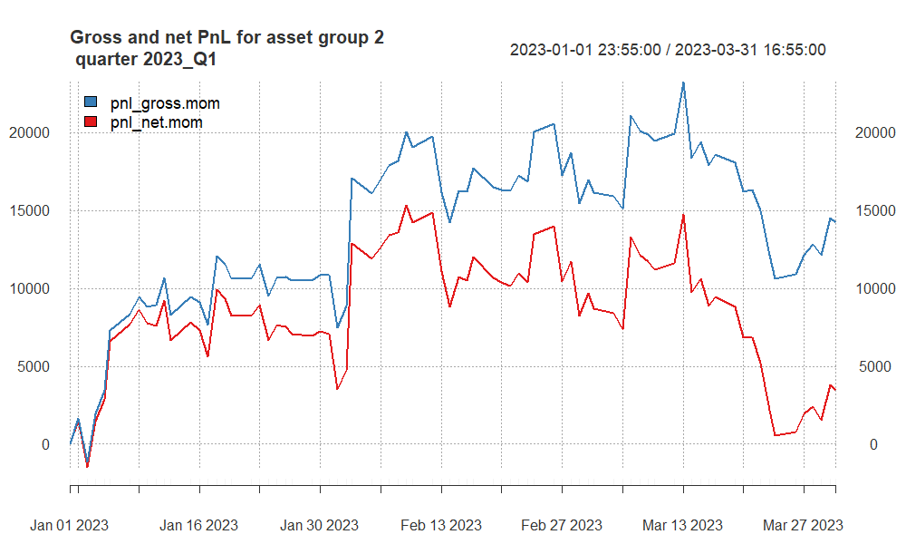

```

**Mixed Performance**: The trading strategy exhibits a mixed performance throughout the quarter. The gross PnL fluctuates and has several peaks and valleys, indicating periods of profit and loss.

**End of Quarter**: Both lines end the quarter on a downward note, with the net PnL indicating that the strategy incurred losses after accounting for transaction costs.

## PnL of results for **group 2** -- quarter 2023Q2

```{r, echo = F, out.width ='70%'}
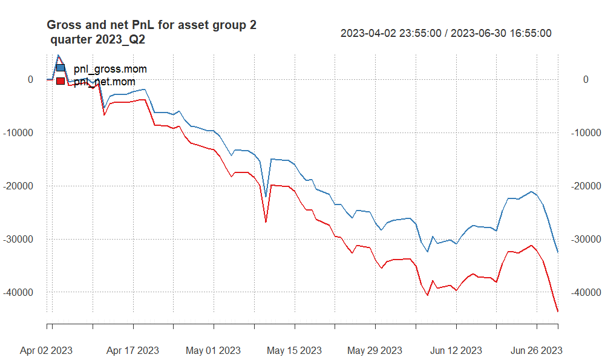

```

**Mid-Quarter Fluctuations**: While there are some recoveries and upward movements mid-quarter, these are not sustained, and the trend continues downward.

**End-of-Quarter Drop**: The quarter ends with a sharp decline in both gross and net PnL, with the net PnL experiencing a steeper fall, which highlights increased losses after accounting for transaction costs.

## PnL of results for **group 2** -- quarter 2023Q3

```{r, echo = F, out.width ='80%'}
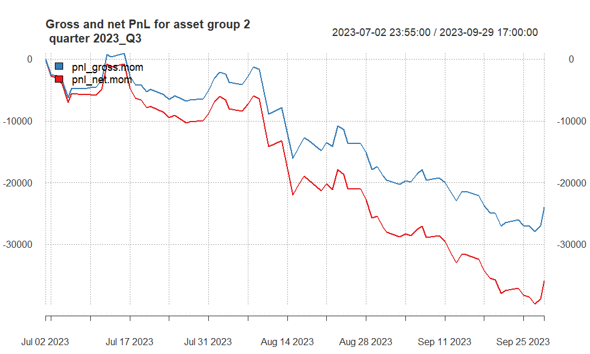

```

**Persistent Downtrend**: Both gross and net PnL are on a persistent downward trend, indicating sustained losses over the quarter.

**Widening Gap**: The gap between the gross and net PnL widens as the quarter progresses, suggesting increasing costs or larger losses when accounting for trading expenses.

**Quarter Conclusion**: The strategy finishes the quarter with net PnL at its lowest, pointing to significant losses after costs.

## PnL of results for **group 2** -- quarter 2023Q4

```{r, echo = F, out.width ='80%'}
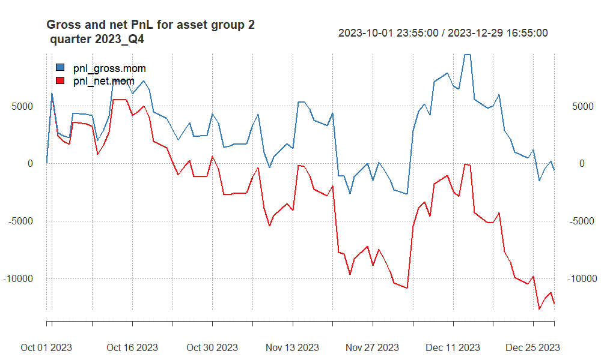

```

**Fluctuating Performance**: There are numerous ups and downs in both gross and net PnL, showing a fluctuating performance throughout the quarter.

**Gross Profits and Net Losses**: The gross PnL occasionally peaks above zero, indicating some profitable moments before costs. However, the net PnL is consistently below zero, suggesting that the strategy is not profitable after accounting for trading costs.

**End of Quarter Trend**: The quarter ends with the net PnL at a significant low, emphasizing the impact of costs on the trading strategy's performance.

# Summary and conclusions

## Summary and conclusions - Group 1:

-   The strategy had varying performance with both strong and weak quarters.

-   The best performing quarters, based on Sharpe and Calmar Ratios and net profits, were **2021_Q1**, **2021_Q4**, and **2023_Q1**. These quarters showed robust risk-adjusted returns and significant profitability.

-   The most challenging quarters were **2021_Q2**, **2022_Q2**, and **2023_Q3**, where the strategy faced substantial losses and negative risk-adjusted performance metrics.

-   Overall, **2021_Q4** and **2023_Q1** stand out as the strongest periods for the strategy, with the highest gross and net PnL, as well as Sharpe and Calmar Ratios.

## Summary and conclusions - Group 2:

-   Group 2's strategy often incurred losses, indicated by the negative gross and net SR and CR values across multiple quarters.

-   Costs appear to have a significant impact, with net PnL being more negative than gross PnL due to trading expenses.

-   There's a lack of consistent profitability, with only one quarter (**2021_Q3**) showing strong performance.

**Overall Summary**:

| quarter | assets.group | grossSR | netSR | grossCR | netCR | av.daily.ntrades | grossPnL |  netPnL  | stat  |
|:------:|:------:|:------:|:------:|:------:|:------:|:------:|:------:|:------:|:------:|
| 2021_Q4 |      1       |  4.69   | 4.06  |  31.38  | 21.98 |      13.091      | 68,387.8 | 59,770.2 | 89.91 |
| 2021_Q3 |      2       |  2.99   | 1.57  |  10.2   | 4.68  |      20.89       | 24,950.2 | 13,418.7 | 12.16 |

When comparing these two specific quarters, which is the best for each group, **Group 1 in Q4 2021 outperformed Group 2 in Q3 2021** across all metrics - Sharpe Ratios, Calmar Ratios, and Profit and Loss figures. The higher 'stat' value for Group 1 suggests a better overall performance measure for this quarter
