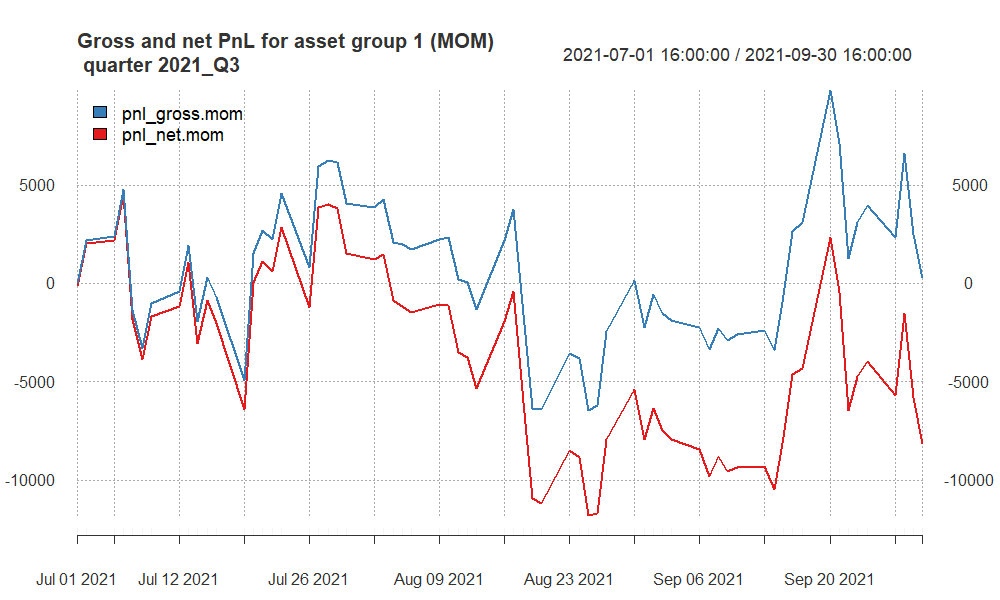
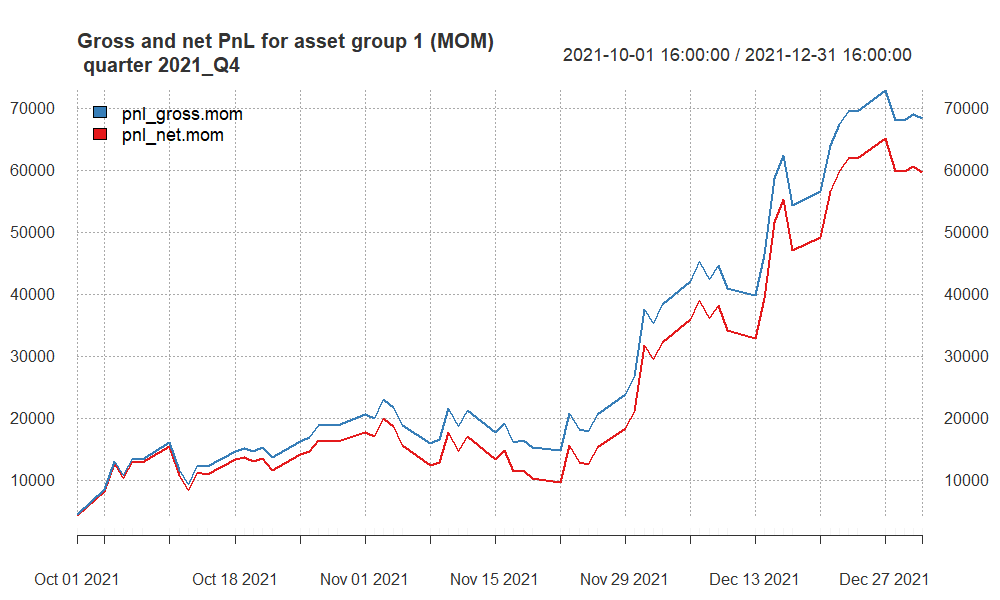
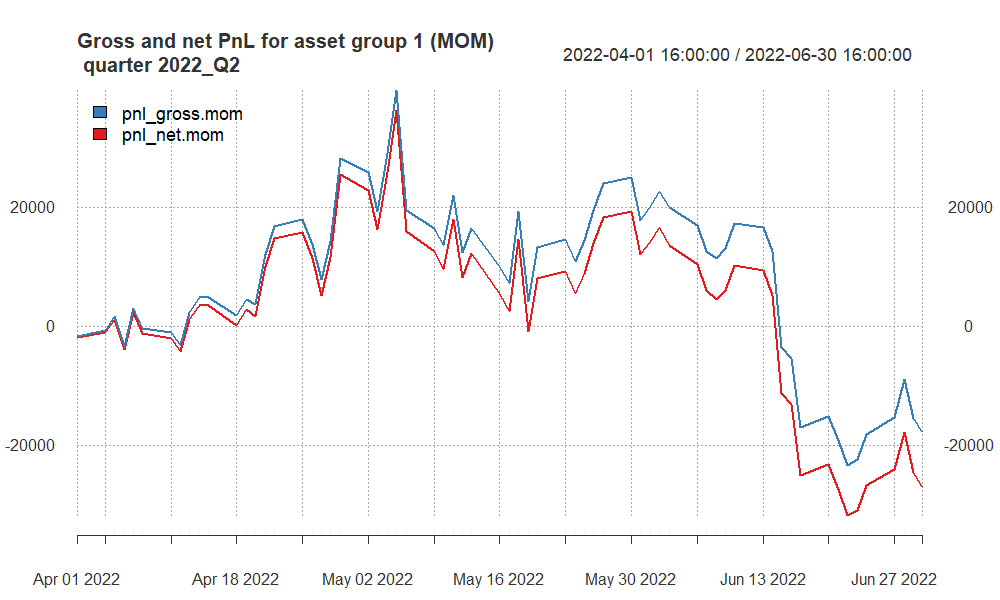
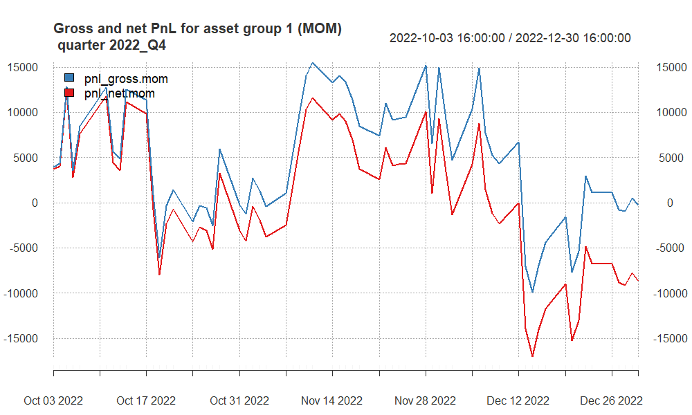
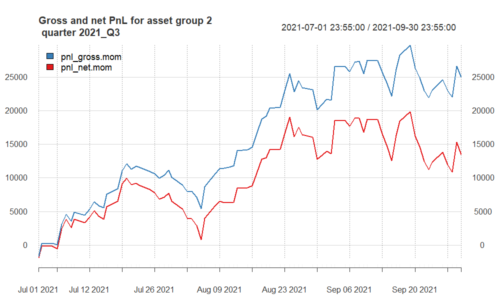
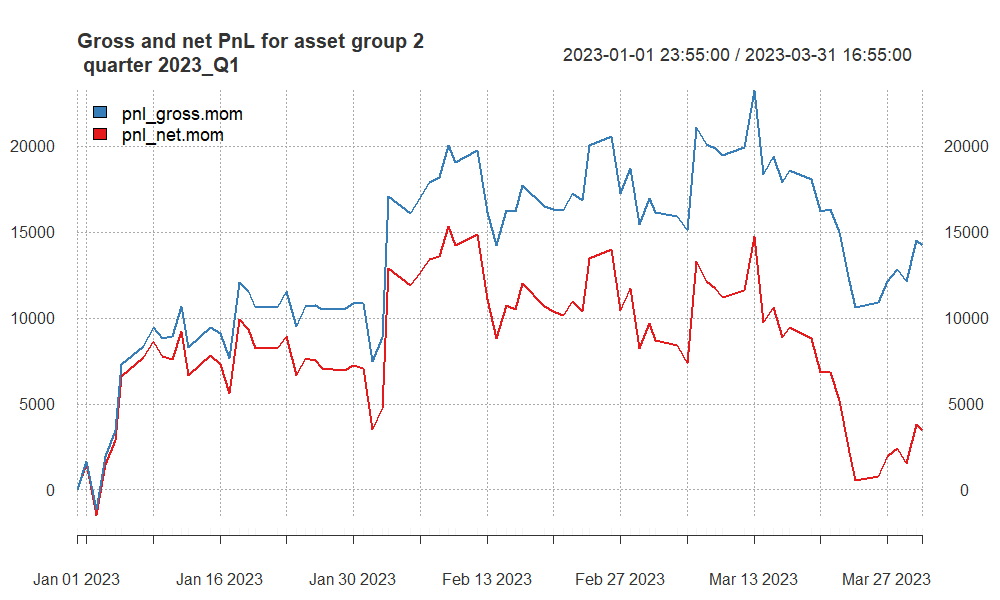
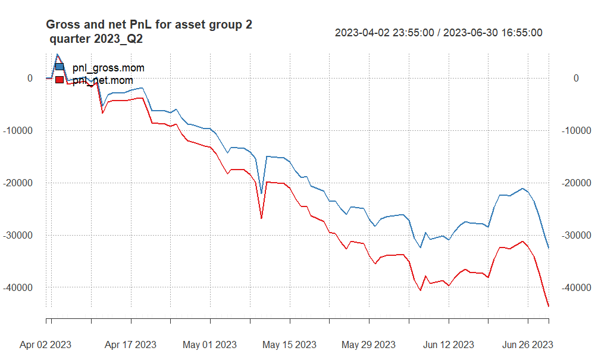

```{=html}
<!-- 
You can find more options here:
http://rmarkdown.rstudio.com/slidy_presentation_format.html
-->
```
## Approaches undertaken

This part should describe **in short** what particular methods you used, all entry/exit techniques considered, all additional assumptions.

For **each group of assets separately** You should also explain **WHAT different parameters** you considered (e.g. memories of moving averages, types of moving averages, types of volatility measures, memory of volatility measures, types of additional indicators, memories of additional indicators, etc.), what (if any) additional filtering rules you applied.

You should also explain with details **HOW** you searched for the best combination of parameters for a particular group of assets.

## Finally selected strategy for **group 1**

For both asset (NQ and SP) I trade based on a Moving Average Crossover strategy using the 55-period and 80-period Exponential Moving Averages (EMAs). The use of EMA55 and EMA80 suggests that a trade is initiated when the shorter EMA (55) crosses the longer EMA (80). If EMA55 crosses above EMA80, it might signal a buy, and if it crosses below, it might signal a sell.

```{=html}
<!-- here you can include code chunk that applies the strategy for group 1 and calculates all the summary statistics
-->
```
```{r, echo = F, warning = F, message = F}
# here you can refer to the R codes that apply the strategy
# for asset group 1 to all quarters (in a loop)

source("apply_my_strategy_group1.R")
```

## Summary of results for **group 1**

```{r, echo = F}
names(quarter_stats.all.group1)[5] <- "av.ntrades"
column_spec(
kable_styling(kable(quarter_stats.all.group1[, -2], 
                    "html", 
                    digits = 2,
                    align = "r"),
             font_size = 20),
1:7, width = "30em")

# more options here:
# https://haozhu233.github.io/kableExtra/awesome_table_in_html.html
```

**2021_Q1:** High positive Sharpe ratios and Calmar ratios indicate a very profitable quarter with high returns and acceptable risk.

**2021_Q3:** Negative netSR and netCR, and a negative netPnL suggest that this quarter saw losses that were significant compared to the risk taken.

**2021_Q4:** Very high gross and net Sharpe and Calmar ratios, coupled with high profits, indicate an excellent performance.

**2022_Q2 and 2022_Q4:** Negative Sharpe and Calmar ratios across the board, with significant net losses, showing poor performance during these quarters.

**2023_Q1:** A return to high positive ratios and profits, suggesting a strong recovery from the previous year's losses.

**2023_Q2:** Positive ratios and profits, although lower than 2023_Q1, still indicate a profitable quarter.

## PnL of results for **group 1** -- quarter 2021Q1

```{r, echo = F, out.width ='90%'}
knitr::include_graphics("pnl_group1_2021_Q1.png")

```

-   **Profit and Loss Tracking**: The blue line tracks the gross PnL, which shows the profit or loss before transaction costs. The red line tracks the net PnL, which is the profit or loss after accounting for a transaction cost of \$10 per trade.

-   **Quarterly Peaks and Troughs**: The highest peak in mid-March shows the point at which the strategy was most profitable before a subsequent decline. This could indicate a strong market movement that was successfully captured by the strategy before a reversal or increased market volatility.

-   **End-of-Quarter Performance**: Both PnL lines decline towards the end of the quarter, with the net PnL (red line) showing a steeper decline. This suggests that while the strategy was still profitable, the profits were reduced by transaction costs and possibly other factors such as unfavorable market movements or slippage.

In summary, the trading strategy has demonstrated the ability to generate profits during the first quarter of 2021, but it also faced periods of decline and was impacted by transaction costs. 

## PnL of results for **group 1** -- quarter 2021Q3

```{r, echo = F, out.width ='100%'}


```

your comments required !!!

## PnL of results for **group 1** -- quarter 2021Q4

```{r, echo = F, out.width ='100%'}


```

your comments required !!!

## PnL of results for **group 1** -- quarter 2022Q2

```{r, echo = F, out.width ='100%'}


```

your comments required !!!

## PnL of results for **group 1** -- quarter 2022Q4

```{r, echo = F, out.width ='100%'}


```

your comments required !!!

## PnL of results for **group 1** -- quarter 2023Q1

```{r, echo = F, out.width ='100%'}
knitr::include_graphics("pnl_group1_2023_Q1.png")

```

your comments required !!!

## PnL of results for **group 1** -- quarter 2023Q2

```{r, echo = F, out.width ='100%'}
knitr::include_graphics("pnl_group1_2023_Q2.png")

```

your comments required !!!

## Finally selected strategy for **group 2**

Provide a **general summary** (approach and a set of **final parameters**) for assets from **group 2**. (e.g. momentum strategy, cross over of two exponential moving averages EMA10 and EMA60 - if DIFFERENT strategy used for each asset, you should explain EACH separately.).

```{=html}
<!-- here you can include code chunk that applies the strategy for group 1 and calculates all the summary statistics
-->
```
```{r, echo = F, warning = F, message = F}
# here you can refer to the R codes that apply the strategy
# for asset group 2 to all quarters (in a loop)

source("apply_my_strategy_group2.R")
```

## Summary of results for **group 2**

```{r, echo = F}
names(quarter_stats.all.group2)[5] <- "av.ntrades"
column_spec(
kable_styling(kable(quarter_stats.all.group2[, -2], 
                    "html", 
                    digits = 2,
                    align = "r"),
             font_size = 20),
1:7, width = "30em")

# more options here:
# https://haozhu233.github.io/kableExtra/awesome_table_in_html.html
```

your comments required !!!

## PnL of results for **group 2** -- quarter 2021Q1

```{r, echo = F, out.width ='100%'}
knitr::include_graphics("pnl_group2_2021_Q1.png")

```

your comments required !!!

## PnL of results for **group 2** -- quarter 2021Q3

```{r, echo = F, out.width ='100%'}


```

your comments required !!!

## PnL of results for **group 2** -- quarter 2021Q4

```{r, echo = F, out.width ='100%'}
knitr::include_graphics("pnl_group2_2021_Q4.png")

```

your comments required !!!

## PnL of results for **group 2** -- quarter 2022Q2

```{r, echo = F, out.width ='100%'}
knitr::include_graphics("pnl_group2_2022_Q2.png")

```

your comments required !!!

## PnL of results for **group 2** -- quarter 2022Q4

```{r, echo = F, out.width ='100%'}
knitr::include_graphics("pnl_group2_2022_Q4.png")

```

your comments required !!!

## PnL of results for **group 2** -- quarter 2023Q1

```{r, echo = F, out.width ='100%'}


```

your comments required !!!

## PnL of results for **group 2** -- quarter 2023Q2

```{r, echo = F, out.width ='100%'}


```

your comments required !!!

## Summary and conclusions

Here you should include a summary of obtained results and some conclusions.
